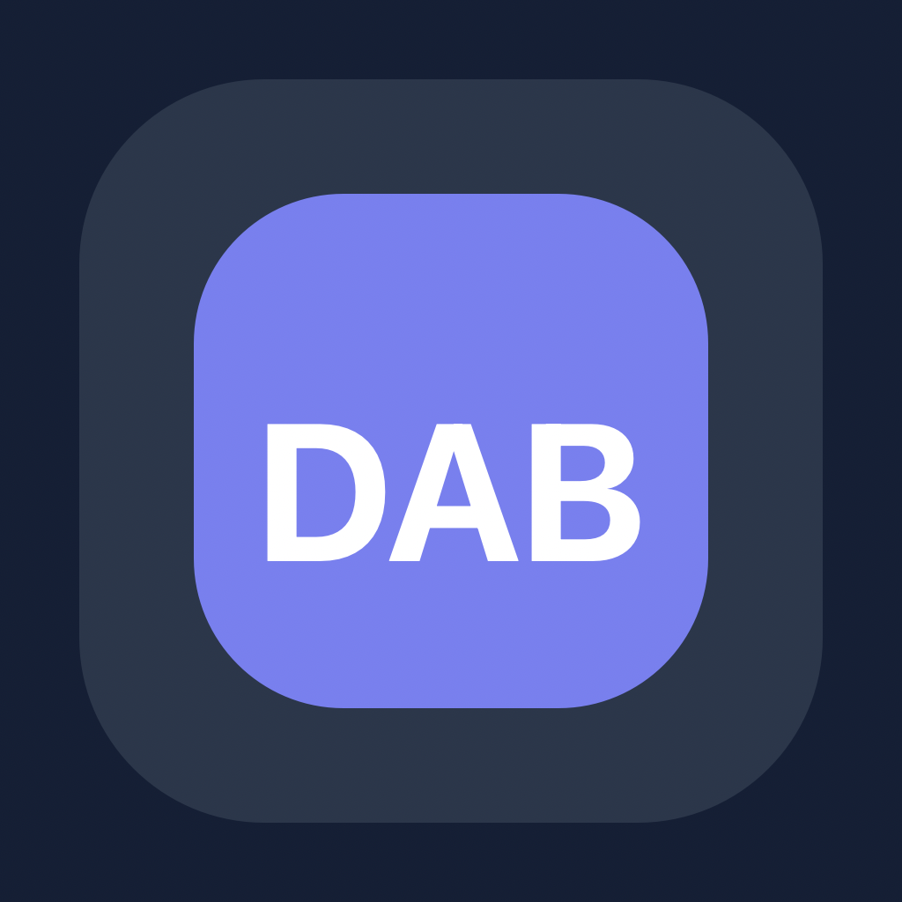

<p align="center">
  
</p>

<h1 align="center">DAB (Dev Activity Board) ⚡</h1>

<p align="center">
  
  
  
  
  
</p>

> **"The Open-Source, Self-Hosted Event Bus for Modern Engineering Teams"**
> *Reclaim your screen. Reclaim your focus.*

One inbox for GitHub, Slack, Jira, Linear, Figma, Phorge, and the rest of your
stack. Self-hosted. Read-only. Built so you can stay in flow.

<p align="center">
  
  
  
  
  
  
  
  
  
</p>

---

## 🌩️ Destroy the "Alt-Tab Tax"

As developers, **Flow State** is our most precious currency. Yet we spend it
recklessly on fragmented tools. The mental re-indexing cost of jumping between
Slack, Jira, Phorge, Linear, GitHub, and Figma is a hidden tax on every line of
code you write.

- **The cost of re-indexing:** Switching tools takes ~20 minutes to mentally
  re-index after an interruption.
- **Desktop fragmentation:** Multiple Electron apps consume gigabytes of RAM
  and crowd out your IDE, terminal, and debugger.
- **Notification fatigue:** Critical PR approvals and assigns are buried under
  Slack FYIs because there is no unified priority queue.

**DAB** is the centralized nerve center that aggregates every signal into a
single, high-performance interface — a personal inbox for what was directed at
you, a Following lane for objects you pin, and a searchable historical pulse
for the team. Your tools stay the source of truth. **DAB never writes back.**

| Feature | The Old Way 🐌 | The DAB Way ⚡ |
| :--- | :--- | :--- |
| **Context Switching** | 7+ browser tabs & background apps | One lean, unified dashboard |
| **Visibility** | Fragmented notifications & "Where was that?" | A single, searchable chronological pulse |
| **Privacy** | Your IP living in everyone else's cloud | 100% Self-Hosted. Your data, your rules. |
| **Speed** | Waiting for page refreshes & cloud lag | Sub-second real-time sync via WebSockets |

Native clients for Desktop (Windows, Mac, Linux) and Mobile (Android, iOS).

---

## What you get

- **Dashboard** — A personal inbound inbox. **Directed at you** (mentions,
  assignments, CCs, git watches) and **Following** (later updates on objects
  you pin). Archive, unfollow, live WebSocket, optional local OS banners while
  the window is unfocused. Standing in a Slack channel or owning a Jira project
  does **not** flood the inbox.
- **Explorer** — Historical activity browser across providers, with an
  org-calendar date strip and a local cache.
- **Insights** — Team-level KPIs and breakdowns without turning DAB into a
  surveillance product. Visibility without micro-management.
- **Reports** — Personal daily reports listed by date under Directory (today
  is always available for your own). Curate lines, add DAB-only notes, copy
  or download Markdown. Managers and admins can read a teammate’s report;
  only the owner can edit. Nothing is posted back to providers.
- **Admin & Settings** — Provider Connect (OAuth), identities, webhook URLs,
  and either **managed** (org tokens + full admin) or **individual** (slim
  per-user) deployment. First registered user becomes admin.

### A Tuesday, in one place

| Time | Provider | Activity |
| :--- | :--- | :--- |
| 09:12 | Phorge | Commented on **T2222** (*"Refactored event bus"*) |
| 11:34 | Jira | You were assigned **DAB-1258** |
| 14:05 | Slack | @you in **#schema** |
| 16:22 | GitHub | Pushed to **dab/main** on a branch you watch |
| 16:40 | Figma | Comment on a file you follow |

That is the product: a personal inbound inbox, not another chat, not another
project manager. DAB turns noise into a searchable narrative — the "what did I
do today?" log, generated from real events.

---

## 🛡️ Sovereignty by Design (Security)

DAB isn't a SaaS; it's **Sovereign Infrastructure**. Your activity data is your
team's most sensitive engineering IP. We treat it with appropriate respect.

*   **🔒 Encrypted credentials:** Per-user provider tokens are AES-256 encrypted at rest (`DAB_CREDENTIALS_KEY`).
*   **🌐 Network isolation:** Data stays inside your infrastructure. No hidden telemetry. No product pings.
*   **🕵️ Auditable core:** 100% Open-Source. Verify every encryption primitive yourself.
*   **🔑 JWT enforcement:** Signed sessions for REST and the live WebSocket.
*   **📬 Read-only observer:** DAB never comments, merges, or changes a ticket. If it is in your stack, it stays in your stack.

Self-host with Docker Compose, or run one always-on Railway replica — see
**[doc/deployment.md](./doc/deployment.md)**. No hidden SaaS dependencies in
the product itself.

**Hybrid ingestion:**

- **Push (webhooks / Gateway):** Real-time triggers for GitHub, GitLab,
  Bitbucket, Slack, Jira, Linear, Figma, Phorge Herald, and Discord Gateway.
- **Pull (polling):** Explorer history and firewalled / on-prem tools.
- **The live bus:** API and clients stay synced over WebSocket (`ws://` locally,
  typically `wss://` in production) for sub-second event propagation.

---

## 🗺️ The "Thermal" Roadmap

We prioritize integrations based on **Thermal Heat** — community pulse and
developer friction points.

| Provider | Status | What ships today |
| :--- | :--- | :--- |
| **Phorge** | ✅ Active | Maniphest tasks + Differential revisions; Herald live path |
| **GitHub** | ✅ Active (commits v1) | Push webhook + polling; Issues/PR timeline still planned |
| **GitLab** | ✅ Active (commits v1) | REST polling + Push Hook |
| **Bitbucket** | ✅ Active (commits v1) | REST polling + `repo:push` |
| **Slack** | ✅ Active (messages v1) | Identity-scoped messages; Events API live path |
| **Discord** | ✅ Active (messages v1) | REST polling + Gateway WebSocket |
| **Jira** | ✅ Active (issues + comments v1) | JQL polling + signed webhook |
| **Linear** | ✅ Active (issues + comments v1) | GraphQL polling + signed webhook |
| **Figma** | ✅ Active (comments + last-edited v1) | File comments + last-edited heartbeats |
| **Microsoft Teams** | 🔜 Planned | Removed from v1; Graph change notifications are operationally heavy |

Connect with OAuth in Settings — or run **individual** mode if it is just you
and a few PATs.

Adding a custom internal tool is a Domain **`AbsIActivityPort<T>`**, an
infrastructure **Source**, a DTO `toActivities` mapping, and a
`TypedConnectorPair` registration — see
**[doc/overview.md](./doc/overview.md)** and
**[doc/architecture.md](./doc/architecture.md)**.

---

## 🏗️ Repository Architecture

| Component | Tech Stack | Responsibility |
| :--- | :--- | :--- |
| **[dab_api](./dab_api)** | Dart + Relic | The Hub. Ingestion, normalization, REST + WebSocket. |
| **[dab_app](./dab_app)** | Flutter | The UI. Real-time [glassmorphism](https://en.wikipedia.org/wiki/Glassmorphism) dashboard. |
| **[bruno/](./bruno)** | Bruno | Git-native API collection. |
| **[doc/](./doc)** | Markdown + OpenAPI | The **single source of truth** for architecture, API, and ops. |

### Tech stack

| Concern | Technology |
| :--- | :--- |
| API runtime | Dart + Relic HTTP framework |
| API DB | PostgreSQL (Drift ORM) |
| API cache | Redis (Vegas versional clock) |
| API transport | WebSocket + REST |
| App framework | Flutter |
| App state | flutter_riverpod (`Notifier` / `NotifierProvider`) |
| App navigation | go_router |
| App local storage | ObjectBox |
| App networking | Dio + `web_socket_channel` |
| Serialization | dart_mappable (both packages) |
| Error handling | fpdart `Either<Failure, T>` |
| Deployment | Docker Compose (local) · Railway (hosted, one replica) |

---

## 🚀 Speed-to-Flow (Getting Started)

**You need:** Docker, Flutter, and a few minutes.

### 1️⃣ Boot the Nerve Center

```bash
cd dab_api
docker compose up -d  # Postgres, Redis, API, and Swagger go live
```

🌐 **Services:**

- **Core API**: [http://localhost:9080](http://localhost:9080)
- **WebSocket**: `ws://localhost:9080/ws`
- **Swagger Docs**: [http://localhost:9081](http://localhost:9081)

> Default host ports moved off the 808x range to avoid collisions with other
> local APIs. Override via `API_PUBLIC_PORT`, `SWAGGER_PUBLIC_PORT`, and
> `DART_VM_PUBLIC_PORT` in `dab_api/.env`. Railway / hosted API:
> **[doc/deployment.md](./doc/deployment.md)**.

### 2️⃣ Launch the Dashboard

```bash
cd dab_app
flutter pub get && flutter run
```

The client defaults to `http://localhost:9080`. Point it at a hosted API with:

```bash
flutter run --dart-define=DAB_API_BASE=https://<your-api>
```

Open the app → register the first user (that account is admin) → **Settings →
Connect** a provider you already use. Directed events show up on the Dashboard
as they happen.

### 3️⃣ Feel the Pulse

Open the **[Bruno Collection](./bruno)**, select the `local` environment, and
run the **Login** request. Your local activity bus is now live.

---

## 📖 Documentation

| Doc | Contents |
| :--- | :--- |
| **[doc/overview.md](./doc/overview.md)** | Product problem, solution, provider status |
| **[doc/architecture.md](./doc/architecture.md)** | Clean Architecture, entities, data flow |
| **[doc/api.md](./doc/api.md)** | Backend controllers and ingestion |
| **[doc/app.md](./doc/app.md)** | Flutter client, views, design system |
| **[doc/infrastructure.md](./doc/infrastructure.md)** | PostgreSQL, Redis, Docker |
| **[doc/deployment.md](./doc/deployment.md)** | Local Compose vs Railway |
| **[doc/conventions.md](./doc/conventions.md)** | Naming and stack |
| **[doc/openapi.yaml](./doc/openapi.yaml)** | HTTP contract (aligned with Bruno) |

---

## 🤝 Join the Sovereignty Movement

DAB exists because developers deserve visibility without micro-management. We
are built for those who value their focus above all else — a screen that still
belongs to the IDE, and activity data that never leaves your infrastructure.

**Stop searching. Start building.**
