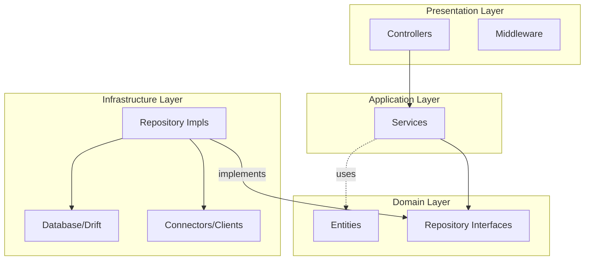

# DAB API: Architectural Blueprint 🏛️ ⚙️

## 📊 Architecture Schema


The DAB API is built for **Scale, Reliability, and Domain Purity**. It leverages Dart & Relic with a strictly enforced Clean Architecture.

## ⛩️ Design Philosophy: Clean Architecture (Exhaustive Analysis)
DAB utilizes a strictly layered architecture to decouple fundamental business logic from transient infrastructure (DBs, APIs).

### ⚖️ Trade-off Analysis: Why Clean Architecture?
| Aspect | Clean Architecture (Current) | Standard MVC (Rejected) | Rationale |
| :--- | :--- | :--- | :--- |
| **Testability** | High (Pure Domain) | Low (Coupled to DB) | Business rules are tested without SQL/Redis mocks. |
| **Maintainability** | High (Separated Layers) | Medium (Giant Controllers) | Logic exists in UseCases, not in entry points. |
| **Boilerplate** | High (Many files) | Low (Few files) | We accept architectural overhead for long-term health. |
| **DI Errors** | compile-time/runtime | Runtime failures | Clean Arch forces clear contract definitions, catching DI errors earlier. |

### 1. Domain Layer (`lib/src/domain`)
- **Entities**: Pure data classes using `DartMappable`. Uses `ActivityProvider` sealed hierarchy for polymorphic metadata.
- **Failure Hierarchy**: Sealed `Failure` classes (e.g., `ServerFailure`, `AuthFailure: InvalidCredentials`) ensure exhaustive pattern matching.
- **Repository Contracts**: Abstract interfaces (prefixed with `I`) strictly reside here. Uses `fpdart`'s `Either<Failure, T>` as default return type.

### 2. Infrastructure Layer (`lib/src/infrastructure`)
- **Table-Per-Type (Polymorphism)**: We avoid `JSONB` for provider metadata. Each provider (Phorge, Slack) has a dedicated relational table joined at query time.
- **Drift ORM Integration**: Leveraging AOT-generated row classes for performance and type-safety.
- **Connectors**: High-fidelity clients (e.g., `PhorgeClient` for Conduit) with localized error mapping.

---

## 🧩 The Envelope Pattern: Multi-Consumer Safety
To prevent client-side "deserialization guesswork", every response adheres to this contract:

```json
{
  "data": [...],
  "meta": {
    "dataType": "list:activity",
    "syncToken": "1024",
    "timestamp": "2026-03-03T10:00:00Z",
    "pagination": { "current": 1, "next": 2 }
  }
}
```
### 🏷️ Mandatory Discriminators (`dataType`)
Clients use the `dataType` string as a key for their `dart_mappable` registry, enabling instant polymorphic deserialization.
- **Types**: `list:activity`, `object:user`, `object:sync_state`, `list:insight`.

---

## 🔄 The Vegas Pattern: Staleness-Optimized Sync
DAB uses a high-performance integer-based versioning system in Redis:
1.  **Global Counter**: A single Redis key `dab:version` is incremented on *any* successful write to the DB via `RedisService.incrementVersion()`.
2.  **Vegas Middleware**: Analyzes the `X-Sync-Token` header. If it matches the Redis version, the API returns a `304 Not Modified` instantly.
3.  **Fan-Out Pattern**: Every activity is fanned out to:
    - `activities:global`: Rolling LIST of the last 500 items (Dash-Burst).
    - `activities:user:{id}`: Per-user history LIST.
    - `activities:date:{iso}`: ZSET for temporal sharding.
4.  **O(1) Insights**: Leaderboards are maintained via `ZINCRBY` on personal and category-specific ZSETs.

---

## 💉 Dependency Management & DI
DAB uses **`GetIt`** as a service locator to enable **Isolate-Safe** dependency access.

### 🛡️ DI Safety Strategy
- **Interfaces**: Always register implementation against abstract Interface (`sl.registerLazySingleton<IAuthRepository>(() => SqlAuthRepository(sl()))`).
- **Initialization**: Database and external clients are initialized lazily to improve startup time.

---

## 🛠️ Implementation Specs: Relic & Dart
- **Native WebSockets**: Uses `RelicWebSocket` for zero-dependency real-time broadcasts.
- **Worker Isolates**: Complex processing (e.g., webhook fan-out) is wrapped in `Isolate.run()` to keep the main event loop responsive.
- **Relational Polymorphism**: Implemented via `leftOuterJoin` in `ActivityRepository`, rebuilding `ActivityProvider` objects from child tables.


---

## 💉 Dependency Injection (`GetIt`)

DAB uses a service locator pattern for centralized lifecycle management. This simplifies testing and decouples business logic from specific implementation details.

### Service Registration Map (`lib/src/service_locator.dart`):

1.  **Infrastructure (DB)**: `AppDatabase` (singleton).
2.  **Repositories**: `AbsIAuthRepository`, `AbsIActivityRepository`.
3.  **Services (Application Layer)**:
    - `PresenceService`: WebSocket session tracking.
    - `LoggingService`: Audit and Debug logging.
    - `PushNotificationService`: Firebase/APNS bridge.
    - `AuthService`: Domain logic for sessions.
    - `ActivityService`: Core aggregation and broadcasting logic.

### Dependency Flow
Controllers and Middleware retrieve dependencies via `sl<Type>()`, ensuring that the `Presentation` layer remains agnostic of how `Services` are instantiated.

---

## 🧪 Verification & Testing Guide

### 1. Registration & Domain Guard
```bash
# Verify domain rejection (expect 403)
curl -X POST http://localhost:8080/register -d '{"email": "hacker@gmail.com"}'

# Verify Admin Auto-Promotion (first user matching admin@domain)
curl -X POST http://localhost:8080/register -d '{"email": "admin@acme.com", ...}'
```

### 2. Authentication Logic
- **JWTMiddleware**: Ensures `accessToken` presence and validity.
- **ActivityController**: Extracts `userId` from the request context via `userIdProperty`.

### 3. Phorge Syncing
Verify the `PhorgeClient` via the Conduit `maniphest.search` endpoint:
- **Polling**: Default 60s interval.
- **Connector**: Handles the mapping of `ownerPHID` to DAB `userId`.
