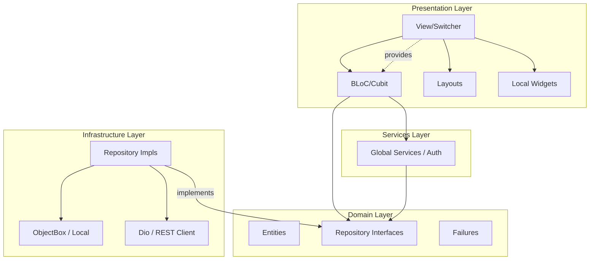

# DAB Client: Application Blueprint 📱 ✨

## 📊 Architecture Schema

The DAB Client is a premium Flutter application focusing on real-time visibility and a state-of-the-art user experience.

## 🏗️ Client Architecture: Standard Clean
The application follows a strictly enforced 3-layer flow:

### 1. Structure (`lib/src/`)
- **`domain/`**:
  - `entities/`: Lean, immutable data classes with `dart_mappable`.
  - `repositories/`: Abstract interface definitions.
  - `failures/`: Sealed hierarchy for error handling.
- **`infrastructure/`**:
  - `repositories/`: Implementations of domain interfaces.
  - `data_sources/`: Low-level network (`Dio`) or database (`ObjectBox`) clients.
  - `mappers/`: DTO ➔ Entity conversion logic.
- **`presentation/`**:
  - `views/`: Self-contained folders for each screen.
  - `features/`: Global cross-cutting state (Auth, Theme).
  - `core/`: Shared UI (Glassmorphic cards, standard buttons).

---

## ✨ Design System: Premium Glassmorphism

### 🎨 Visual Core
DAB uses a futuristic, immersive "frosted glass" aesthetic:
- **Primary Background**: `#0F172A` (Deep Slate).
- **Surface**: `rgba(30, 41, 59, 0.7)` with **20-30px Backdrop Blur**.
- **Border**: `1px solid rgba(255, 255, 255, 0.1)` for crystal edges.
- **Provider Glowing Accents**:
  - **Slack**: Purple Aura (`#4A154B`)
  - **Phorge**: Crimson Aura (`#8F2A3B`)
  - **GitHub**: Slate Aura (`#24292F`)

### 🎬 Micro-Animations
- **Entry Pulse**: New activities arrive with a spring-based scale and subtle brand-colored glow.
- **Staggered Loading**: Dashboard cards fade in sequentially using a 50ms stagger.
- **Interactive Shimmer**: Hovering over a card triggers a subtle light-sweep across the glass surface.

---

## ⛩️ Architectural Standard: The "View" Pattern
To ensure professional consistency, every UI module must follow the **DAB View Hierarchy**:

- **Location**: `lib/presentation/views/[view_name]/`
- **Mandatory File Set**:
  - `[view_name]_view.dart`: The "Switcher". Handles `BlocProvider` and `LayoutBuilder` orchestration.
  - `[view_name]_bloc.dart` / `[view_name]_cubit.dart`: Logic layer extending `AbsBloc` or `AbsCubit`.
  - `[view_name]_state.dart`: Immutable state class (always a separate file).
  - `layout/`: Folder containing `[view_name]_view_mobile.dart` and `[view_name]_view_desktop.dart`.
  - `widgets/`: Local UI components private to this specific view (One widget per file).

### 🧩 Base Logic Lifecycle
Every Bloc/Cubit inherits capabilities from **`AbsBloc`**:
- **Static AppResolver**: Injects `AppCubit` access without requiring context.
- **OnInitialize**: Blocs/Cubits use `onInit` in `AppBlocBuilder` for safe, one-time data fetching.

---

## ✨ UI/UX Specification: The Glassmorphic System
DAB's aesthetic is optimized for high-density developer data.

### 1. Visual Foundation (Precision Specs)
- **Glass Surfaces**: 
  - `BackdropFilter` sigma: **8.0** (standard) to **12.0** (active/focus).
  - Surface Color: `rgba(30, 41, 59, 0.4)` (Deep Slate Transparent).
  - Border: `1.0px` solid `rgba(255, 255, 255, 0.1)`.
  - Inner Shadow: Subtle top-left highlight for 3D depth.
- **Typography Engine**:
  - **Interface**: `Inter` (Sans-serif) for high-clarity navigation.
  - **Technical**: `Roboto Mono` for IDs, PHIDs, and Git hashes.
- **Provider Accents**:
  - **Slack**: Purple Aura (`#4A154B`)
  - **Phorge**: Crimson Aura (`#8F2A3B`)
  - **GitHub**: Slate/Silver Aura (`#24292F`)

### 2. Micro-Animations & Motion
- **Staggered Entrance**: Activity feed cards must animate in sequentially with a **50ms** stagger delay.
- **Glow Interaction**: Hovering over interactive cards adds a dynamic `BoxShadow` with the provider's specific brand color glow.
- **Terminal Transitions**: Page switches must use a smooth **Fade + Slide-Up** transition (300ms duration).

---

## 🗺️ Application Views & Screens
DAB maintains a strictly separated set of views, each with a dedicated strategic purpose and implementation pattern. Every View must reside in `lib/presentation/views/[view_name]/`.

| View | Strategic Goal | Primary Implementation Pattern |
| :--- | :--- | :--- |
| **Dashboard** | Real-time Awareness | **Streamed List**: Uses `AppBlocBuilder` on a WebSocket activity stream. |
| **Explorer** | Context & History | **Chronological Strip**: Features a selectable calendar UI (Time-Strip) for archive retrieval. |
| **Statistics** | Behavior Analysis | **Aggregated Charts**: Area and donut charts built from sharded daily metrics stored in ObjectBox. |
| **Settings** | Personal Preferences | **Dynamic Forms**: Tool linking (Phorge/Slack) and high-fidelity theme toggles. |
| **Admin Console**| System Guarding | **List/Action**: Global user management with activation/deactivation triggers. |

---

## 🧩 Global Application Features (Architecture)
Beyond individual screens, DAB manages cross-cutting concerns at the **Feature** level located in `lib/presentation/features/`.

- **`AuthCubit` (Authentication)**: 
  - Manages global `Session` lifecycle.
  - Controls **Auth Guards** in `GoRouter`.
  - Persists sensitive keys (JWT) in **Secure Storage**.
- **`AppCubit` (Global State)**:
  - Centralizes theme (Slate/Crystal) and locale.
  - Manages global notification broadcasts.
  - Extends `AbsCubit` for unified `appResolver` access.
- **`MonitoringFeature`**:
  - Background "Safety Net" verifying API health and WebSocket heartbeat.

---

## ⛩️ Architectural Standards & Governance

### 1. The "View" Pattern (Strict Hierarchy)
1. `[view]_view.dart`: Handles `BlocProvider` and `LayoutBuilder` (Responsive Switcher).
2. `layout/`: Folder containing `[view]_view_mobile.dart` and `[view]_view_desktop.dart`.
3. `[view]_bloc.dart`: Logic extending `AbsBloc`.
4. `[view]_state.dart`: Immutable state using `dart_mappable`.
5. `widgets/`: Local components (one widget per file).

### 2. State Management Rules
- **UI Consumables**: Use `AppBlocBuilder`, `AppBlocListener`, or `AppBlocConsumer`.
- **Initialization**: Use `onInit` callback in `AppBlocBuilder` for one-time initialization (e.g., event dispatch).
- **Global Access**: Access `AppCubit` via the inherited `app` getter in any Bloc or Cubit.

---

## ✨ UI/UX Specification: The Glassmorphic System
DAB's aesthetic is optimized for high-density developer data and visual excellence.

### 1. Visual Foundation (Precision Specs)
- **Glass Surfaces**: 
  - `BackdropFilter` sigma: **8.0** to **12.0**.
  - Surface Color: `rgba(30, 41, 59, 0.4)`.
  - Border: `1.0px` solid `rgba(255, 255, 255, 0.1)`.
- **Typography Engine**:
  - **Interface**: `Inter`.
  - **Technical**: `Roboto Mono` (IDs, Hashes).
- **Motion System**:
  - Staggered entrances (50ms).
  - Spring-based scale transitions.
  - Hover-triggered brand glow (Slack Purple, Phorge Crimson).

---

## 📱 Infrastructure Foundations (`dab_app`)

### 1. Dual-Tier Persistence Strategy
- **ObjectBox (Performance)**: Activity records and metadata for O(1) scrolling. Models must implement `toDomain()`.
- **Secure Storage (Security)**: Sensitive JWTs and API keys using native Keychain/Keystore.

### 2. Networking (**Dio**)
- **RestApiClient**: Custom instance with JWT interceptors.
- **VegasInterceptor (Sync)**: A dedicated interceptor that injects the `X-Sync-Token` header into requests from `SystemLocalDataSource` and extracts/saves the updated token from the `meta.syncToken` envelope on successful responses.
- **Failure Mapping**: Automatic mapping to Domain `AppFailure` hierarchy.
- **Functional API**: All repository methods must return `Either<Failure, T>`.

### 3. Functional Standards
- **Either Handling**: Infrastructure must return `Either<Failure, T>`.
- **UI Safety**: Presentation layer uses pattern matching (e.g., `fold`) for clean error UI rendering.

