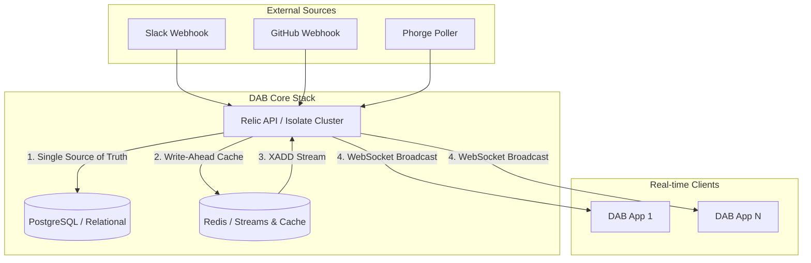

# DAB Infrastructure: Technical Blueprint 🏗️ ⚙️

## 📊 System Topology & Event Fan-Out
DAB is built on a high-availability "Push" architecture to ensure zero-lag synchronization across large teams.

### 📈 Scalability & Performance Targets
- **Developer Density**: Optimized for **100+ concurrent developers** per instance.
- **Feed Latency**: Sub-**50ms** end-to-end (Event Ingestion -> Dashboard Display).
- **Resource Footprint**: Minimal overhead (<100MB base RAM usage via Relic/Dart AOT).
- **Graceful Degradation**: If Redis is offline, the API falls back to PostgreSQL polling (latencies increase to ~200ms).

---

## 🐳 Containerization (Exhaustive Docker Stack)
DAB utilizes an isolated, multi-container architecture to ensure high-performance execution.

### 1. `docker-compose.yml` specs
| Service | Image/Build | Ports | Internal/External | Rationale |
| :--- | :--- | :--- | :--- | :--- |
| **`db`** | `postgres:16-alpine` | `5433:5432` | Relational Store | Production-grade SQL with native AOT migrations. |
| **`api`** | `relic` (build target) | `8081:8081` | Relic App Cluster | Multi-isolate worker pool for concurrent request handling. |
| **`redis`** | `redis:7-alpine` | `6379:6379` | Cache & Stream Layer | Backbone of the Vegas Pattern and Task Streams. |

### 2. Startup Command (AOT/JIT Switch)
- **Development**: `dart run --enable-vm-service=8181/0.0.0.0 bin/dab_api.dart` (Hot reload enabled).
- **Production**: Compiled native binary via `dart compile exe bin/dab_api.dart -o bin/api_server`.

---

## 🗄️ Database Architecture (PostgreSQL/Drift)
- **Native Migrations**: Handled via `MigrationStrategy` in `AppDatabase`. SQL creation logic is embedded in `onCreate` blocks for atomic environment setup.
- **Relational Standard**: Table-per-type polymorphism (e.g., `activity_phorge`) ensures strict 1:1 metadata integrity with `CASCADE DELETE`.

---

## 🗄️ Extreme-Perf Caching & Reliability (Redis)
DAB leverages Redis for bandwidth-saving sync and distributed task resilience.

### 1. Multi-Level Caching Strategy
| Redis Key | Type | Use Case | Implementation Detail |
| :--- | :--- | :--- | :--- |
| **`activities:global`** | LIST | Rolling dashboard feed | `LPUSH` + `LTRIM` to keep last 500 activities in O(1) memory. |
| **`activities:date:{yyyy-mm-dd}`** | ZSET | Real-time daily analytics | Score is `timestamp`. Used for area-chart range queries. |
| **`insights:rankings:{date}:{cat}`**| ZSET | Top Contributors | `ZINCRBY` on every activity ingestion for real-time leaderboards. |

### 2. The Vegas Pattern (Sync Strategy)
- **Sync Token**: A global integer version managed via `INCR dab:version` in Redis.
- **Header Injection**: Clients pass their last known version in every request. 
- **Staleness Logic**: If `token < redis_version`, the API serves only the missing delta from the Redis LIST or DB. Otherwise, it returns `304 Not Modified`.

### 3. Task Scheduling & Fault Tolerance (Redis Streams)
DAB uses **Redis Streams** to handle high-volume event fan-out:
1.  **Job Ingestion**: Webhooks push raw data to `dab:stream:events` via `XADD`.
2.  **Groups**: Workers operate in a **Consumer Group**, ensuring zero duplicate processing.
3.  **Resilience**: The **Pending Entity List (PEL)** tracks unacknowledged tasks. If a worker fails, other workers claim staled events via `XCLAIM`, guaranteeing 100% ingestion reliability.

---

## 🚀 Infrastructure Deployment & Walkthrough
This guide details the step-by-step process for deploying the DAB infrastructure in both Development and Production environments.

### 1. Development Setting (Local Docker)
- **Launch**: `docker-compose up -d`.
- **Verify**: `docker-compose logs -f api` should report "Server listening on http://0.0.0.0:8081".
- **Hot Reload**: Relic monitors the mounted `/app` volume for instant updates.

### 2. Production Deployment (Native AOT)
- **Build**: `docker build -t dab_api:latest .`.
- **Run**: Requires environment injection (`JWT_SECRET`, `DB_HOST`, etc.) as defined in the environment section.

### 3. Infrastructure Health Verification Matrix
Once deployed, verify the system health using these standard checks:

| Check | Target | Expected Result |
| :--- | :--- | :--- |
| **API Pulse** | `GET /health` | `{"status": "ok", "version": "1.0.0"}` |
| **DB Connection** | `GET /health/db` | `{"connected": true, "latency_ms": 2}` |
| **Auth Guard** | `GET /activities` | `401 Unauthorized` (without JWT) |
| **WebSocket** | `ws://host:8081/ws`| Successful upgrade and stream heartbeat. |

---

## 🔐 Configuration Guardrails
- **JWT Middleware**: Enforces signed tokens for all `/api/` sub-routes except `/auth`.
- **Domain Lockdown**: Rejects registrations outside the `DAB_ALLOWED_DOMAIN` specified in environment variables.
- **CORS Policy**: Strictly locked to authorized client origins.
