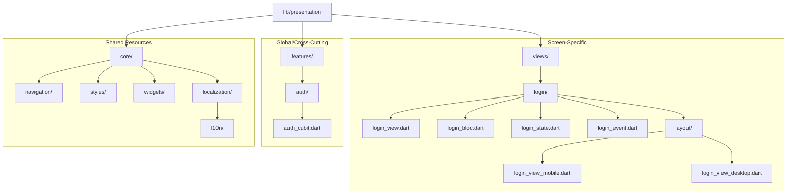

# Presentation Layer Hierarchy

This document visualizes the organization of UI components (**Views**) and global state management (**Features**) within the `presentation` layer.

## 🗺️ Structural Overview

## 📂 Component Breakdown

### 1. Views (`lib/presentation/views/`)
Each **View** represents a complete screen in the application. They are self-contained and follow a strict internal structure.

| Component | Responsibility | Mandatory |
| :--- | :--- | :---: |
| `[view]_view.dart` | The **Entry Point & Switcher**. Handles `BlocProvider` and loads `layout/`. | ✅ |
| `[view]_bloc.dart` | Business logic (Cubit or Bloc) for the screen. | ✅ |
| `[view]_state.dart` | Immutable state class (`dart_mappable`). | ✅ |
| `[view]_event.dart` | UI events/actions (`dart_mappable`). | ✅ |
| `layout/` | Directory for `[view]_view_mobile.dart` and desktop versions. | ✅ |

#### 📋 Summary of Views

| View Name | Route | Responsive | Description |
| :--- | :--- | :---: | :--- |
| **Login** | `/login` | ✅ | User authentication screen (Email/Password). |
| **Settings** | `/settings` | ✅ | Global application settings (Theme, Localization). |

### 2. Features (`lib/presentation/features/`)
**Features** manage global states that are shared across multiple views or represent core system functionality.

| Component | Responsibility |
| :--- | :--- |
| `[feature]_cubit.dart` | Logic for global state changes (e.g., Authentication status, Theme). |

#### 📋 Summary of Features

| Feature Name | Primary Cubit | Description |
| :--- | :--- | :--- |
| **Auth** | `AuthCubit` | Global authentication state, token management, and session monitoring. |

### 3. Core (`lib/presentation/core/`)
Foundational utilities and shared UI building blocks.

- **`navigation/`**: Centralized routing via `AppRouter` and `AppRoute`.
- **`styles/`**: Custom themes, colors, and design tokens (`AppTheme`).
- **`core/` (Utility)**: Custom Bloc utilities (`AppBlocBuilder`, `AppBlocListener`, `AppBlocConsumer`) and base classes (`AbsBloc`, `AbsCubit`).
- **`widgets/`**: Reusable atomic widgets (Buttons, TextFields) used across views.
- **`localization/`**: Localization-specific logic and helpers.
  - **`l10n/`**: Application Resource Bundle (`.arb`) files for translations.
