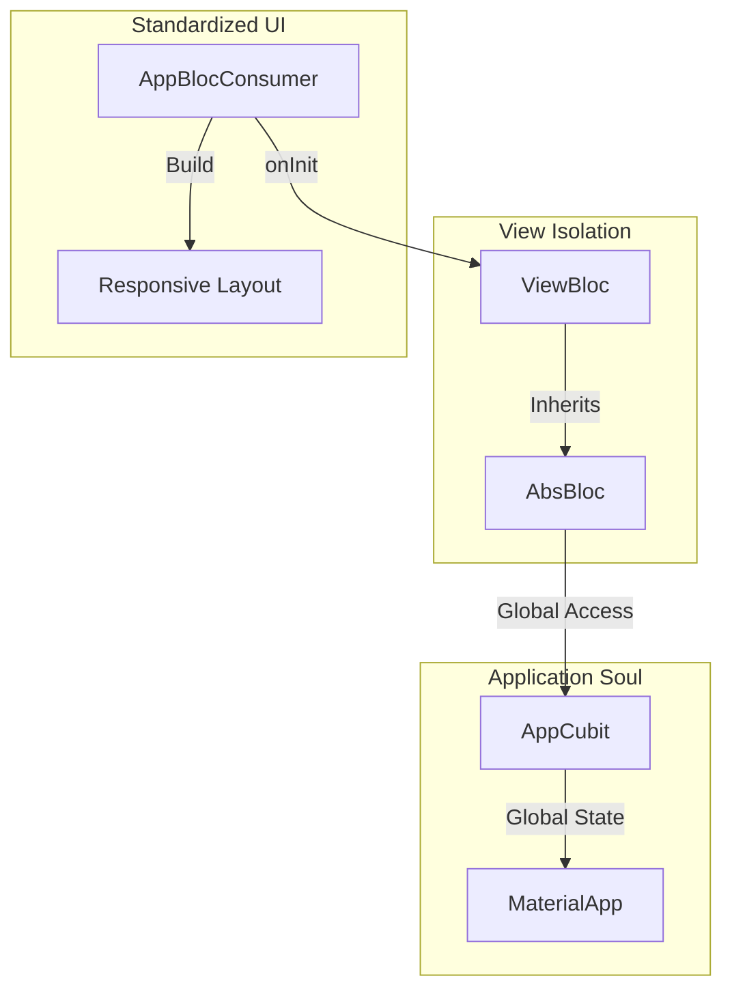

# Client Architecture - Final Wrap-up

We have successfully completed the core architectural foundation for the `dab_app`. This phase established a robust, scalable, and developer-friendly structure that adheres to Clean Architecture while minimizing boilerplate for common tasks.

## 🏆 Accomplishments

### 1. Standardized State Management
- **Base Classes**: All logic now resides in `AbsBloc` and `AbsCubit`, ensuring a unified API and safe consumer interaction.
- **Global `app` Access**: Implemented a non-static instance getter `app` in all base classes, powered by a strictly typed static resolver. This provides instant access to global settings (Theme, Locale, Auth) without constructor injection.

### 2. Custom Presentation Utilities
- **`AppBlocBuilder`**: Replaces `BlocBuilder` with a safe `onInit` callback.
- **`AppBlocListener`**: Replaces `BlocListener` with standardized lifecycle handling.
- **`AppBlocConsumer`**: Combined utility for state-driven UI and side-effects.
- **Logs**: Integrated optional debug logging directly into the UI consumers.

### 3. Clean Responsive Views
- Established a strict folder structure for views (`layout/`, `widgets/`, `bloc/`).
- Implemented the first standardized feature: **Settings**, which serves as the blueprint for all future development.

## 🏗️ The Final Architecture

## 🛠️ Verification & Readiness
- **Code Integrity**: All "red" lines and lint errors resolved.
- **Build System**: `build_runner` fully synced.
- **Documentation**: All core architectural guides updated to the final state.

---
**The project is now officially ready for Feature Implementation & Localization! 🚀🏢🏘️✨✨**
