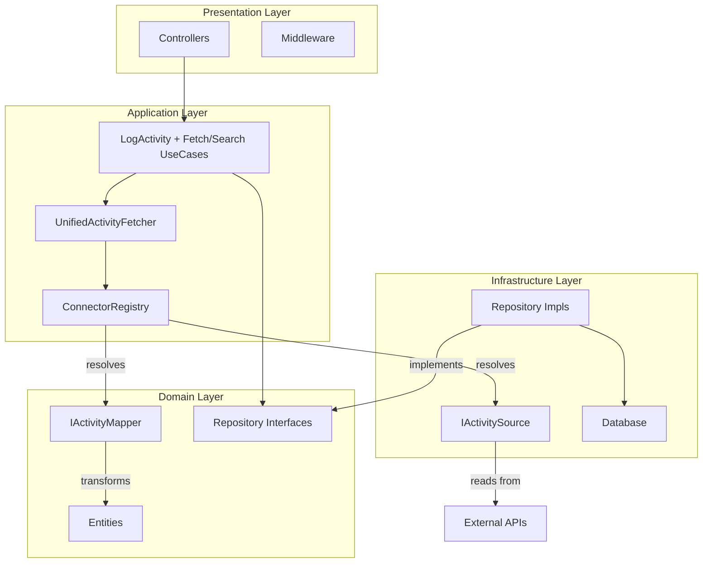

# DAB API — Backend Architecture

> **Linear source:** [Dab Api](https://linear.app/dev-activity-board/document/dab-api-8608282c089c) · Last synced: 2026-04-08  
> **Package:** `dab_api/` · Runtime: Dart + Relic · DB: PostgreSQL (Drift) · Cache: Redis · SDK: `^3.9.2`

---

## Architecture Schema

---

## Layer Details

### 1. Domain Layer (`lib/src/domain/`)

The innermost layer. **Zero imports from Infrastructure or Application.**

- **Entities:** Pure data classes using `dart_mappable`. Current entities:
  - `Activity` — normalized event with `ActivityProvider` sealed metadata
  - `ActivityProvider` — sealed hierarchy for provider-specific payloads
  - `User` — DAB user with role (`admin`, `manager`, `standard`), group, and active state
  - `UserIdentity` — Maps a DAB user to an external platform. States: `linked`, `pending`, `failed`.
  - `Group` — organizational grouping
  - `Session` — active auth session (JWT + refresh token)
  - `ProviderConfig` — external tool configuration (`name`, `baseUrl`, `iconUrl`, `configJson`)
  - `ProviderMetadata` — registered connector metadata

- **Mappers (`IActivityMapper`):** Define the business rules for transforming provider-specific DTOs into a `DAB Activity`. Mappers live in Domain because they encode business meaning (e.g., "a Phorge transaction of type COMMENT becomes an Activity of type comment").

- **Repository Interfaces:** Abstract contracts prefixed with `I` (e.g., `IActivityRepository`). Return `Either<Failure, T>` via `fpdart`.

---

### 2. Infrastructure Layer (`lib/src/infrastructure/`)

**Key constraint:** Read-only. DAB is an observer. Providers must **never** implement mutation endpoints.

- **`IActivitySource` implementations (`sources/`):** Specialized provider fetchers returning provider-specific DTOs — never domain entities.

- **`connectors/`:** Provider HTTP clients / protocol adapters (for example, Phorge Conduit client + endpoint wrappers).

- **`repositories/`:** Concrete SQL implementations using Drift + PostgreSQL. Implement Table-Per-Type polymorphism via `leftOuterJoin`.

- **`database/`:** Drift schema definitions, DAOs, and `MigrationStrategy`. Never hand-edit generated `*.g.dart` files.

- **`dtos/`:** Provider-specific Data Transfer Objects. Never leak outside Infrastructure.

- **`security/`:** JWT signing/verification (via `dart_jsonwebtoken`), bcrypt password hashing. All secrets come from `Config`.

- **`config/`:** `Config` — loads env vars at startup. Single source for all configuration.

- **Relative URL Strategy:** Providers generate relative paths (e.g., `/T123`). The DAB app resolves full URLs using `baseUrl` from `ProviderConfig`.

---

### 3. Application Layer (`lib/src/application/`)

Orchestrates use cases and coordinates Domain + Infrastructure without coupling to either.

- **`ConnectorRegistry`:** Single source of truth for all registered provider connectors. Pairs each `IActivitySource` with its corresponding `IActivityMapper` at boot.

- **`UnifiedActivityFetcher`:** Orchestrates **parallel fetching** across all registered providers. Aggregates results into a unified stream.

- **`LogActivity` use case:** Persists activity, increments Vegas version in Redis, and broadcasts over WebSocket via `PresenceService`.
- **Activity query use cases:** `GetRecentActivities`, `SearchActivities`, and `FetchRemoteActivities`.
- **Auth workflows:** Implemented through `AuthUseCases` (`RegisterUser`, `AuthenticateUser`, `RefreshUserToken`, etc.).

---

### 4. Presentation Layer (`lib/src/presentation/`)

Thin entry points only. No business logic.

#### Controllers

| Controller | Path | Key Responsibilities |
|---|---|---|
| `ActivityController` | `/activities*`, `/ws`, `/integrations/slack/events` | Historical feed (`/activities`), Redis live feed (`/activities/live`), Slack Events webhook ingestion (`/integrations/slack/events`), date search (`/activities/search`), authenticated WebSocket stream (`/ws`) |
| `AdminController` | `/admin/*` | Identity list/summary, manual link, resolve workflow, admin user role management |
| `AuthController` | `/auth/*` | Register, login, refresh token |
| `GroupController` | `/groups/*` | Group management |
| `HealthController` | `GET /health`, `/health/db` | Pulse check, DB connectivity |
| `MetadataController` | `/metadata/*`, `/admin/configs*` | Public bootstrap status/configs, provider metadata list, provider capability matrix (`/metadata/capabilities`), admin provider config save/test |
| `UserController` | `/users/*` | User profile, identity linking |

#### Middleware

- **Vegas Middleware:** Compares client `X-Sync-Token` against Redis version. Returns `304 Not Modified` on fresh token.
- **JWT Middleware:** Validates signed tokens on all protected sub-routes.
- **WebSocket auth guard:** `/ws` is protected by JWT middleware and uses request-context identity for scoped delivery.
- **Domain Lockdown:** Enforced by registration use cases (`RegisterUser` / bootstrap lock rules), not by HTTP middleware.
- **Admin middleware:** After bootstrap, authorizes `/admin/*` using the **database** user role (not only JWT) so promotions apply immediately.
- **`GET /metadata/status` `isSystemConfigured`:** `true` when there is at least one admin **and** at least one **active** provider config.

---

## Design Philosophy: Modular Provider Architecture

| Aspect | Modular (Current) | Monocore Connector (Rejected) |
|---|---|---|
| **Extensibility** | High — adding GitHub takes minutes | Low — hard-coded per provider |
| **Domain Purity** | High — mappers live in Domain | Low — logic bleeds into Infrastructure |
| **Parallelism** | Multi-source fan-out (concurrent) | Serial polling |
| **Maintainability** | Single-responsibility classes | God objects |

---

## Dependency Injection (GetIt)

All registrations in `lib/src/service_locator.dart`. Use `sl<T>()` to resolve.

| Category | Key Registrations |
|---|---|
| Application | `ConnectorRegistry`, `UnifiedActivityFetcher`, activity/auth use-case containers |
| Services | `PresenceService`, `LoggingService`, `IdentityDiscoveryService` |
| Repositories | `ActivityRepository`, `AuthRepository`, `UserRepository`, `ProviderConfigRepository` |

**Rule:** `singleton` for stateful services, `factory` for stateless use cases.

---

## Provider Roadmap

| Provider | Status | Protocol |
|---|---|---|
| Phorge | ✅ Active | Conduit REST API |
| GitHub | ✅ Active (Commits v1) | REST |
| Slack | ✅ Active (Messages v1) | Slack Web API |
| Jira | 🧪 Scaffolded | REST |
| Linear | 🧪 Scaffolded | REST |
| Teams | 🧪 Scaffolded | REST |
| Discord | 🧪 Scaffolded | REST |
| GitLab | 🔜 Planned | REST |
| Bitbucket | 🔜 Planned | REST |

GitHub v1 ingestion is commits-only and uses provider-linked identities from
`user_identities` (`provider_id: github`) to scope authored fetches. Bootstrap
remains local-first for the first admin; teams can onboard with any provider
afterward (no Phorge prerequisite).

Slack v1 ingestion is message-only and strictly identity-based (`provider_id:
slack`). Connector execution and attribution require linked Slack user IDs in
`user_identities.external_id`; there is no email fallback during mapping. The
admin test-connection endpoint validates Slack credentials using `auth.test`,
and expected settings are `botToken` plus optional `channels` and `apiBaseUrl`.

Provider live-ingestion capabilities are exposed via `GET /metadata/capabilities`
to support dashboard strategy selection (webhook/websocket first, polling
fallback).

Slack true-live ingestion is handled via `POST /integrations/slack/events`
(Events API webhook). The endpoint validates Slack signatures, acknowledges
quickly, and processes event callbacks asynchronously into DB + Redis live keys
and scoped WebSocket delivery. Message routing is mention-targeted: activities
are created per recipient when a message includes direct user mentions (`<@U...>`),
broadcast mentions (`@all`, `<!channel>`, `<!here>`, `<!everyone>`), or Slack
user-group mention tokens (`<!subteam^...>`). Messages without target mentions
are ignored for live-feed ingestion.

For local webhook testing, generate signature headers from the exact raw request
body using:
`./scripts/generate_slack_signature.sh "$SLACK_SIGNING_SECRET" /path/to/body.json`

---

## Development Commands

| Action | Command |
|---|---|
| Analyze | `dart analyze` |
| Run tests | `dart test` |
| Start server | `dart run bin/dab_api.dart` |
| Start via Docker | `cd dab_api && docker-compose up -d` |
| Regenerate code | `dart run build_runner build --delete-conflicting-outputs` |
| Health check | `curl http://localhost:8080/health` |
