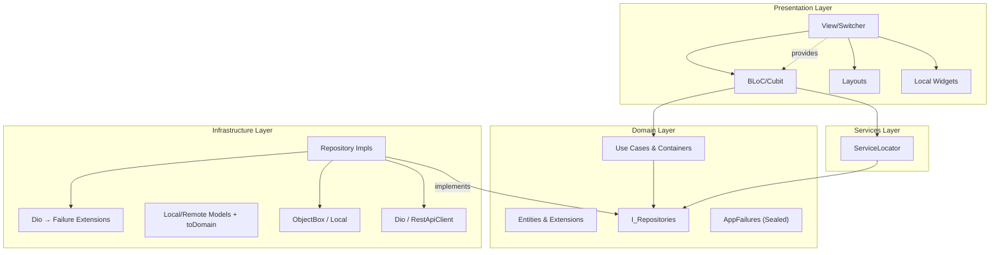

# DAB App — Flutter Client Architecture

> **Linear source:** [Dab Client](https://linear.app/dev-activity-board/document/dab-client-05e24723cfe7) · Last synced: 2026-04-08  
> **Package:** `dab_app/` · Framework: Flutter · SDK: `^3.9.2`

---

## Architecture Schema



---

## Layer Details

### 1. Domain Layer (`lib/domain/`)

Pure Dart. Zero Flutter or third-party framework imports.

- **Entities:** Business objects — no "Entity" suffix. Current entities include:
  - `Activity` — normalized activity event
  - `ActivityCategory` — canonical activity classification enum
  - `ActivitySearchQuery` — shared activity filter contract across local/remote search
  - `ActivityProvider` — sealed hierarchy for provider-specific payloads
  - `User` — DAB user with role, group, and provider identity links
  - `UserIdentity` — maps DAB user to external provider account
  - `Group` — organizational grouping
  - `ProviderConfig` — external tool settings (`baseUrl`, `iconUrl`, `configJson`)
  - `Presence` — real-time online/offline status
  - `AuthResponse` — JWT + refresh token pair
  - `AppSettings` — persisted client settings (`themeMode`, `syncToken`)
  - `SprintContext` — optional sprint metadata attached to provider payloads

- **Entities use `dart_mappable`** for serialization, equality, and `copyWith`.

- **Extension-First:** Any helper on an entity is an `extension OnUser on User` co-located in the **same file**.

- **Use Cases:** Atomic business actions (e.g., `Login`, `FetchActivities`).

- **Use Case Containers:** Aggregators (e.g., `AuthUseCases`) that group related use cases and inject the required `IRepository` instances.

- **Repository Interfaces:** `abstract interface class I[Name]Repository extends IRepository`. Returns `Either<AppFailure, T>`.

- **Failures:** Sealed `AppFailure` hierarchy — `ServerFailure`, `NetworkFailure`, `CacheFailure`, `AuthFailure`, etc.

---

### 2. Infrastructure Layer (`lib/infrastructure/`)

Implements Domain contracts. Handles protocols, APIs, and databases.

- **Repositories:** Concrete `[Name]Repository extends Repository implements I[Name]Repository`. Orchestrate datasources.

- **Datasources:**
  - **Remote:** `RestApiClient` wrapping Dio. Includes `VegasInterceptor` for sync token management and `AuthInterceptor` for JWT injection + refresh.
  - **Local:** `ObjectBoxStore` — ultra-fast O(1) device persistence.

- **Models:** DB/API-specific DTOs. **Every model must** have an `extension On[Model] on [Model]` with a `toDomain` getter, co-located in the same file.

- **Error Mapping:** Converts `DioException` → `AppFailure`. Located in `lib/infrastructure/core/extensions/dio_extensions.dart`.

---

### 3. Presentation Layer (`lib/presentation/`)

Handles UI and state via `flutter_bloc`.

#### The View Hierarchy (mandatory structure)

Every screen module in `lib/presentation/views/[view_name]/` must follow:

```
[view_name]/
├── [name]_view.dart           ← "Switcher": BlocProvider + LayoutBuilder routing
├── layouts/                   ← device-specific layouts (mobile, desktop)
│   ├── [name]_view_mobile.dart
│   └── [name]_view_desktop.dart
├── [name]_cubit.dart          ← OR: [name]_bloc.dart + [name]_event.dart
├── [name]_state.dart          ← immutable, isolated state file using ViewStatus
├── models/                    ← feature-local enums and data classes
└── widgets/                   ← private local widgets (strictly one per file)
```

#### Application Views

Home branches (**Dashboard**, **Explorer**, **Insights**, **Admin**) use the shared **Island Bar** shell (`IslandBar` in `lib/presentation/core/widgets/island_bar.dart`) with identical padding and height where applicable. **Dashboard** and **Admin** pass branch **content** widgets (`DashboardIslandBarContent`, `AdminIslandBarContent`). **Explorer** uses `ExplorerIslandBarContent`, which wraps `IslandBar` around the date strip only and keeps the calendar title row (`ExplorerCalendarHeader`) below the bar, matching the legacy layout. On desktop, Explorer now pairs the feed with a foldable left sidebar split into **Directory**, **Activities**, and **Providers** checklist sections. **Insights** mirrors this shell pattern and adds filterable analytics cards/charts (date/date-range, users, providers, activity types) rendered with DAB glassmorphism tokens. **Admin** metrics are projected from `AdminState` via `OnAdminState.islandBarModel` (co-located in `admin_state.dart`) into `AdminIslandBarModel` (`views/admin/models/`), with one widget per file under `views/admin/widgets/` for each island tile type.
The home shell branding uses `DAB` as the primary mark and keeps `Dev Activity Board` readable as secondary text on supported widths.

| View | Role | State Pattern |
|---|---|---|
| **Splash** | App bootstrap + redirect | Router-driven auth gate handoff |
| **Login** | Auth gate | Form events handled by `AuthBloc`; session persisted in `AuthCubit` |
| **Dashboard** | Real-time activity feed | Initial hydration from `GET /activities/live`, then live updates via authenticated `/ws` stream |
| **Explorer** | Historical activity browser | Chronological strip with selectable timeframe |
| **Insights** | Filterable behavior analytics | KPI + trend + provider/type/user breakdowns with details table |
| **Settings** | User personalization | Dynamic forms — tool linking, theming |
| **Admin Console** | System administration | Multi-tab dashboard: **Provider Config** (with live connection pulsing), **Identity Management** (Approval workflow), **Security** (user search), and an **Admin** nav badge when identities need resolution (`GET /admin/identities/summary`). |

#### Explorer Historical Cache Strategy

- Explorer searches now use a shared `ActivitySearchQuery` contract across remote and local sources.
- For date windows fully in the past, the repository reads ObjectBox first (`ExplorerActivityRecord`) and only falls back to API when provider coverage is incomplete.
- Coverage is tracked per `(day, user, provider)` via `ExplorerCoverageRecord` so newly activated providers trigger targeted backfill for already-cached days.
- For windows including today, Explorer remains remote-first to keep mutable day data fresh.

---

### 4. Services Layer (`lib/services/`)

- `ServiceLocator` — centralizes all dependency instantiation and injection. This is the only place dependencies are wired together.

---

## State Management Rules

- **Base Classes:** Every Cubit extends `AbsCubit`; every Bloc extends `AbsBloc`.
- **ViewStatus:** All states must use the unified `ViewStatus` enum (`initial`, `loading`, `success`, `failure`) for standardized status management.
- **One Widget Per File:** View and Layout files must not contain private widgets or widget-returning functions. They must be extracted to the `widgets/` folder.
- **Global AppCubit:** Accessible via the inherited `app` getter in any Bloc/Cubit, or via static `AbsBloc.appCubit` for constructor initializers.
- **UI Builders:** Always use `AppBlocBuilder`, `AppBlocListener`, or `AppBlocConsumer`. Use the `onInit` callback for one-time initialization logic.
- **Cubits call use cases only** — never datasources or repositories directly.
- **No business logic in widgets.** Widgets read state and dispatch events — nothing more.

---

## Navigation (go_router)

All routes are declared in `presentation/core/navigation/app_route.dart` and wired in `presentation/core/navigation/app_router.dart`.

- Use named routes — never push raw path strings.
- Auth guards (`redirect` logic) live in the router configuration, not in widgets.
- Never import a screen file directly into another screen for navigation.

---

## Vegas Sync — Client-Side Implementation

1. **Storage:** `AppSettingsRecord` in ObjectBox stores the global `syncToken`.
2. **VegasInterceptor:**
   - **Outgoing:** Injects `X-Sync-Token` header.
   - **Incoming:** Extracts `meta.syncToken` from envelope responses and updates ObjectBox.
   - **Short Circuiting:** On `304 Not Modified`, repositories return cached ObjectBox data immediately.
3. **Real-Time Layer:** WebSocket connection pushes new events while the app is alive.

---

## Dynamic Deep-Linking & Provider Config Resolution

1. **Bootstrap:** On init, `AppCubit` fetches `List<ProviderConfig>` from `/metadata/configs`.
2. **Resolution:** `ActivityCard` matches `Activity.provider.name` against the loaded configs.
3. **URL Joining:** If the backend provides a relative path (e.g., `/T123`), the card prepends `ProviderConfig.baseUrl`.
4. **Icons:** Provider icon resolution is centralized in `ProviderIconResolver`:
   `ProviderConfig.iconUrl` → `ProviderStyles` brand map → `simple_icons` fallback → `AppIcons.unknownProvider`.

---

## Auth & Token Security

- JWTs stored exclusively in `FlutterSecureStorage` (native OS Keychain / Keystore).
- Token refresh handled entirely by `AuthInterceptor` — cubits must not trigger refresh manually.
- On logout: clear both cubit state and secure storage atomically.
- **Phorge Identity Linking:** Client maps `User.ownerPHID` to their DAB `userId` to filter personal backlogs.

---

## Design System: Premium Glassmorphism

The project uses a unified design system centered around Material 3 roles, implemented in `lib/presentation/core/styles/`.

| Token Category | File | Description |
|---|---|---|
| **Colors** | [app_colors.dart](file:///Users/dhallz/git/dab/dab_app/lib/presentation/core/styles/app_colors.dart) | M3 roles + Electric Indigo (`#6366F1`) & Glass Tokens |
| **Spacing** | [app_spacing.dart](file:///Users/dhallz/git/dab/dab_app/lib/presentation/core/styles/app_spacing.dart) | Base 4px grid (tiny=4, small=8, medium=16, large=24) |
| **Typography** | [app_text_styles.dart](file:///Users/dhallz/git/dab/dab_app/lib/presentation/core/styles/app_text_styles.dart) | **Mona Sans** for UI, **JetBrains Mono** for monospaced text |
| **Layout** | [app_layout.dart](file:///Users/dhallz/git/dab/dab_app/lib/presentation/core/styles/app_layout.dart) | Viewport constraints, standard border radii (12-24px) |
| **Icons** | [app_icons.dart](file:///Users/dhallz/git/dab/dab_app/lib/presentation/core/styles/app_icons.dart) | Centralized icon map for the application (`flutty_heroicons` for non-provider UI, `simple_icons` for provider brands) |

### Premium Glassmorphism
- **Surface**: `AppColors.glassSurface` (low opacity slate) + backdrop blur `σ 8–12`.
- **Borders**: Subtile `1px` lines using `AppColors.glassBorder` (white alpha).
- **Branding**: Elevated by **Electric Indigo** accents for high-contrast interactivity.

### Micro-Animations
- **Staggered Entrances:** Dashboard cards animate in with a 50ms stagger.
- **Provider Glow:** Hover reveals `BoxShadow` colored by provider glow roles (e.g., Slack Purple `#4A154B`).
- **Pulsing Connection Icons:** Admin provider cards show real-time connection status (`ViewStatus`: Success/Failure/Loading) with smooth opacity pulsing.
- **Entry Pulse:** Incoming WebSocket events trigger a spring-scale transition.

---

## Development Commands

| Action | Command |
|---|---|
| Analyze | `flutter analyze` |
| Run tests | `flutter test` |
| Run app | `flutter run` |
| Regenerate code | `dart run build_runner build --delete-conflicting-outputs` |
| Generate launcher icons | `flutter pub run flutter_launcher_icons` |
| Generate l10n | Automatic via `l10n.yaml` (`flutter gen-l10n`) |

Launcher icon source asset: `dab_app/assets/branding/app_icon.png`.
