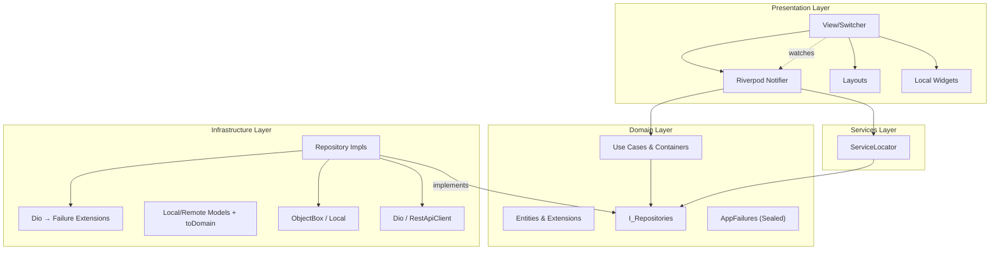

# DAB App — Flutter Client Architecture

> **Linear source:** [Dab Client](https://linear.app/dev-activity-board/document/dab-client-05e24723cfe7) · Last synced: 2026-04-08  
> **Package:** `dab_app/` · Framework: Flutter · SDK: `^3.9.2`

---

## Architecture Schema



---

## Layer Details

### 1. Domain Layer (`lib/domain/`)

Pure Dart. Zero Flutter or third-party framework imports.

- **Entities:** Business objects — no "Entity" suffix. Current entities include:
  - `Activity` — normalized activity event
  - `ActivityCategory` — canonical activity classification enum
  - `ActivitySearchQuery` — shared activity filter contract across local/remote search
  - `ActivityProvider` — sealed hierarchy for provider-specific payloads
  - `User` — DAB user with role, group, and provider identity links
  - `UserIdentity` — maps DAB user to external provider account
  - `Group` — organizational grouping
  - `ProviderConfig` — external tool settings (`baseUrl`, `iconUrl`, `configJson`)
  - `Presence` — real-time online/offline status
  - `AuthResponse` — JWT + refresh token pair
  - `AppSettings` — persisted client settings (`appThemeVariant`: Light, DAB dark, or grayscale Dark with DAB indigo accent; optional `localeCode`; per-view `islandBarSelections`; `syncToken`)
  - `SprintContext` — optional sprint metadata attached to provider payloads

- **Entities use `dart_mappable`** for serialization, equality, and `copyWith`.

- **Extension-First:** Any helper on an entity is an `extension OnUser on User` co-located in the **same file**.

- **Use Cases:** Atomic business actions (e.g., `Login`, `FetchActivities`).

- **Use Case Containers:** Aggregators (e.g., `AuthUseCases`) that group related use cases and inject the required `IRepository` instances.

- **Repository Interfaces:** `abstract interface class I[Name]Repository extends IRepository`. Returns `Either<AppFailure, T>`.

- **Failures:** Sealed `AppFailure` hierarchy — `ServerFailure`, `NetworkFailure`, `CacheFailure`, `AuthFailure`, etc.

---

### 2. Infrastructure Layer (`lib/infrastructure/`)

Implements Domain contracts. Handles protocols, APIs, and databases.

- **Repositories:** Concrete `[Name]Repository extends Repository implements I[Name]Repository`. Orchestrate datasources.

- **Datasources:**
  - **Remote:** `RestApiClient` wrapping Dio. Includes `VegasInterceptor` for sync token management and `AuthInterceptor` for JWT injection + refresh.
  - **Local:** `ObjectBoxStore` — ultra-fast O(1) device persistence.

- **Models:** DB/API-specific DTOs. **Every model must** have an `extension On[Model] on [Model]` with a `toDomain` getter, co-located in the same file.

- **Error Mapping:** Converts `DioException` → `AppFailure`. Located in `lib/infrastructure/core/extensions/dio_extensions.dart`.

---

### 3. Presentation Layer (`lib/presentation/`)

Handles UI and state via **`flutter_riverpod`** (`Notifier` / `NotifierProvider`, `ConsumerWidget`).

#### The View Hierarchy (mandatory structure)

Every screen module in `lib/presentation/views/[view_name]/` must follow:

```
[view_name]/
├── [name]_view.dart           ← LayoutBuilder + post-frame notifier bootstrap
├── layouts/                   ← device-specific layouts (mobile, desktop)
│   ├── [name]_view_mobile.dart
│   └── [name]_view_desktop.dart
├── [name]_notifier.dart       ← Riverpod notifier + provider declaration
├── [name]_state.dart          ← immutable, isolated state file using ViewStatus
├── models/                    ← feature-local enums and data classes
└── widgets/                   ← private local widgets (strictly one per file)
```

#### Application Views

Home branches (**Dashboard**, **Explorer**, **Insights**, **Admin**) use the shared **Island Bar** shell (`IslandBar` in `lib/presentation/core/widgets/island_bar.dart`) with identical padding and height where applicable. **Dashboard** and **Admin** pass branch **content** widgets (`DashboardIslandBarContent`, `AdminIslandBarContent`). **Explorer** uses `ExplorerIslandBarContent`, which wraps `IslandBar` around the date strip only and keeps the calendar title row (`ExplorerCalendarHeader`) below the bar, matching the legacy layout. On desktop, Explorer now pairs the feed with a foldable left sidebar split into **Directory**, **Activities**, and **Providers** checklist sections. **Insights** mirrors this shell pattern and adds filterable analytics cards/charts (date/date-range, users, providers, activity types) rendered with DAB glassmorphism tokens. **Admin** metrics are projected from `AdminState` via `OnAdminState.islandBarModel` (co-located in `admin_state.dart`) into `AdminIslandBarModel` (`views/admin/models/`), with one widget per file under `views/admin/widgets/` for each island tile type.
User-visible strings use **`AppLocalizations`** (`context.l10n` via `lib/presentation/core/localization/l10n_extension.dart`); add keys to `lib/presentation/core/localization/l10n/app_en.arb` and run `flutter gen-l10n`. Secondary locale ARBs (`app_es.arb`, `app_de.arb`, `app_fr.arb`, `app_pt.arb`, `app_it.arb`) should carry the **same message key set** as English (same JSON keys as `app_en.arb` except **`@` metadata entries**—placeholder definitions and `description` live **only** in the template file). Where a translation is still pending, the value may match English until localized. Keys missing from a locale file fall back to the template locale at build time.
The home shell branding uses `brandShortName` / `brandTagline` (`DAB` / **Dev Activity Board**) as primary and secondary marks on supported widths; those strings are **the same in every locale** (product names, not translated).

| View | Role | State Pattern |
|---|---|---|
| **Splash** | App bootstrap + redirect | Always **DAB-branded** (`AppTheme.dab`): mesh background, brand icon + marks + spinner; **`package_info_plus`** shows **Version {semver}+{build}** at bottom after async load. Routing waits **≥ 1s** on-screen then `context.go` once auth resolved (`splash_route_resolution.dart`). **GoRouter** loads splash at **`/`** with **`NoTransitionPage`** (no entry animation). **Auth** and the **home `StatefulShellRoute`** use a shared **fade** (`CustomTransitionPage` in `fade_transition_page.dart`) when replacing splash. Global **`redirect`** treats **`/`** and **`/auth`** as public so cold start is not forced straight to auth before splash runs; protected **`/home/*`** etc. still redirect guests to **`/auth`**. |
| **Login** | Auth gate | Form via `AuthFormNotifier`; session in `authNotifierProvider`. The register toggle is shown **only while `isSystemConfigured` is false** (bootstrap): the first registered user becomes admin; afterwards self-registration is closed and accounts are created from the Admin Console. |
| **Dashboard** | Info capture + upcoming alerts | Initial hydration from `GET /activities/live` (`scope=global` in personal/small-team mode), then live updates via authenticated `/ws` stream. Renders an **Upcoming Soon** section, a periodic in-app **banner** evaluated from `UpcomingEvent`s, and a **Live Now** feed with per-item Archive/Unarchive triage and a Show/Hide archived toggle. Archive is a **personal overlay** on the team wall. |
| **Explorer** | Historical activity browser | Chronological strip with selectable timeframe; on load selects **all** directory users (`selectedUserIds`) then narrows to the signed-in user when matched (same breadth as Insights for the logged-in path). Sidebar **Providers** and **Activities** lists include admin-**activated** providers that are **green** from an Admin Core test **or** a healthy user credential. Directory notes teammates who have not connected a selected provider. **Clear cache and refresh** (calendar header) evicts ObjectBox rows for the active day or range across all browsable providers, then refetches from provider APIs. |
| **Insights** | Filterable behavior analytics | KPI + trend + provider/type/user breakdowns with details table; search uses **`authoredOnly=false`** for team-aggregate provider queries (Explorer keeps **`true`**). Provider and activity-type filters match Explorer: activated providers with a **green** org test or user credential appear and stay synced with `appNotifierProvider`. |
| **Settings** | User personalization | Theme, language, Island Bar, Explorer cache, and **Connected accounts**. GitHub, GitLab, Linear, Jira, and Bitbucket use **Connect with {provider}** (browser OAuth). After Jira is connected, Settings shows a **project picker** that writes instance `projectKeys` (shared watch list for task fetch). Phorge still uses a Conduit token. Slack/Discord bots are configured in Admin. Tokens are never stored on the device. |
| **Admin Console** | System administration | In **organization** mode: Provider Config cards (Core / Live / Polling), Identities, Security. In **personal** mode: **Security** (users, timezone, `public_api_url` for OAuth callbacks, deployment mode; domain lockdown hidden) and a **slim Providers** view (OAuth `clientId`/`clientSecret`, GitLab/Jira `instanceUrl`, Slack/Discord bot + channels). For Jira, paste the OAuth 2.0 (3LO) **Client ID** from the developer console (not App ID), add Jira API permissions, and register `{public_api_url}/integrations/jira/oauth/callback` exactly. Identities are hidden — OAuth whoami links them. Default section is Security. Hidden from non-admins in personal mode. |

#### Dashboard (Live Feed + Triage + Upcoming)

- **Desktop layout** uses the shared glass `AppSidebar` plus a main column with `IslandBar` and `DashboardLiveFeed` (see `DashboardViewDesktop`).
- Sidebar content now includes provider health chips, placeholder counters (`Snoozed`, `Review queue`), and a `lastSyncedAt` timestamp from `DashboardState`.
- Main feed is sectioned: **Upcoming Soon** -> **Awaiting Your Reply** -> **Live Now**.
- **Live Now** renders the remainder of `visibleActivities` from `DashboardState` after urgency-oriented section routing, while still honoring the `showArchivedActivities` toggle.
- Each `DabActivityCard` exposes an Archive action (or Unarchive for already-archived entries) routed through **`dashboardNotifierProvider`** with **optimistic UI** and rollback on failure.
- **Live feed card copy:** Slack uses channel label + truncated summary as the headline, **From** `{sender}` via **`dashboardActivityFromAuthor`**, archived badge via **`dashboardCardArchivedBadge`**, then full message below. Sidebar provider rows use **`dashboardProviderHealth*`** status labels; upcoming cards localize known **`UpcomingEvent.source`** values (e.g. calendar → **`dashboardUpcomingSourceCalendar`**). GitHub commits use **`[branch] {commit subject}`** as the headline (`subject` is the first line of the commit message), **From** **`{linked DAB user name} (@{GitHub login})`**, then the remaining commit description on following lines when present.
- Remote `ACTIVITY_ARCHIVED` / `ACTIVITY_UNARCHIVED` events on the WS stream are surfaced as `ActivityLiveEvent` subtypes (`ActivityReceivedEvent`, `ActivityArchivedEvent`, `ActivityUnarchivedEvent`) and merged into the same list by flipping the entry's `archived` flag in place.
- `DashboardArchiveToggle` surfaces the archived count and switches `showArchivedActivities`.
- **Upcoming Soon** consumes `UpcomingEvent` items from `UpcomingEventUseCases` (currently backed by `PlaceholderUpcomingEventsRepository` until a calendar provider is wired in).
- A periodic timer on `DashboardNotifier` (default every 30s) invokes banner evaluation (`BannerEvaluator`) and chooses at most one active `DashboardBanner` based on priority, time thresholds, and a per-event dedupe key retained in `DashboardState.lastNotifiedEventIds`.
- The active banner is dismissable and re-shows only when a different `dedupeKey` becomes eligible.

#### Explorer Historical Cache Strategy

- Explorer searches now use a shared `ActivitySearchQuery` contract across remote and local sources.
- For date windows fully in the past, the repository reads ObjectBox first (`ExplorerActivityRecord`) and only falls back to API when provider coverage is incomplete.
- On backfill, the repository upserts the **full** mapped API response into ObjectBox. Explorer sidebar filters (`providers`, `categories`) apply only when reading cached rows, so coverage for all browsable providers can be recorded without dropping unselected provider data.
- Coverage is tracked per `(day, user, provider)` via `ExplorerCoverageRecord` so newly activated providers trigger targeted backfill for already-cached days. Day keys follow the organization timezone from bootstrap (`GET /metadata/status` → `AppState.orgTimezoneId`).
- **Settings → Explorer cache** lets users clear cached activities and coverage for a chosen org-calendar date range and provider subset; the next Explorer browse for those days refetches from provider APIs. Admin timezone saves still perform a full cache clear.
- Explorer and Insights date filtering, API query parameters, and ObjectBox cache keys all use the same org-calendar semantics.
- For windows including today, Explorer remains remote-first to keep mutable day data fresh.

---

### 4. Services Layer (`lib/services/`)

- `ServiceLocator` — centralizes all dependency instantiation and injection. This is the only place dependencies are wired together.

---

## State Management Rules

- **Riverpod:** Feature modules expose **`Notifier` / `AutoDisposeNotifier`** classes registered as **`NotifierProvider`** / **`NotifierProvider.autoDispose`** next to the notifier implementation.
- **ViewStatus:** All states must use the unified `ViewStatus` enum (`initial`, `loading`, `success`, `failure`) for standardized status management.
- **One Widget Per File:** View and Layout files must not contain private widgets or widget-returning functions. They must be extracted to the `widgets/` folder.
- **Global app session:** Cross-cutting concerns use **`appNotifierProvider`**, **`authNotifierProvider`**, and router refresh hooks — no static cubit singletons.
- **Widgets:** Prefer **`ConsumerWidget`** / **`ConsumerStatefulWidget`** with **`ref.watch`** / **`ref.read`** on the smallest subtree that needs updates.
- **Notifiers call use cases only** — never datasources or repositories directly.
- **No business logic in widgets.** Widgets read state and call notifier methods — nothing more.

---

## Navigation (go_router)

All routes are declared in `presentation/core/navigation/app_route.dart` and wired in `presentation/core/navigation/app_router.dart`.

- Use named routes — never push raw path strings.
- Auth guards (`redirect` logic) live in the router configuration, not in widgets.
- Never import a screen file directly into another screen for navigation.

---

## Vegas Sync — Client-Side Implementation

1. **Storage:** `AppSettingsRecord` in ObjectBox stores the global `syncToken`.
2. **VegasInterceptor:**
   - **Outgoing:** Injects `X-Sync-Token` header.
   - **Incoming:** Extracts `meta.syncToken` from envelope responses and updates ObjectBox.
   - **Short Circuiting:** On `304 Not Modified`, repositories return cached ObjectBox data immediately.
3. **Real-Time Layer:** WebSocket connection pushes new events while the app is alive.

---

## Dynamic Deep-Linking & Provider Config Resolution

1. **Bootstrap:** On init, **`AppNotifier`** (via `appNotifierProvider`) fetches `List<ProviderConfig>` from `/metadata/configs`.
2. **Resolution:** `ActivityCard` matches `Activity.provider.name` against the loaded configs.
3. **URL Joining:** If the backend provides a relative path (e.g., `/T123`), the card prepends `ProviderConfig.baseUrl`.
4. **Icons:** Provider icon resolution is centralized in `ProviderIconResolver`:
   `ProviderConfig.iconUrl` → `ProviderStyles` brand map → `simple_icons` fallback → `AppIcons.unknownProvider`.

---

## Auth & Token Security

- JWTs stored exclusively in `FlutterSecureStorage` (native OS Keychain / Keystore).
- Token refresh handled entirely by `AuthInterceptor` — presentation code must not trigger refresh manually.
- A 401 on a protected route with no refresh token, or a failed refresh, clears the local session and `authNotifierProvider` so the router returns to Login. That avoids a zombie session where Settings still looks signed-in but `oauth/start` has no Bearer token.
- On logout: clear session via **`authNotifierProvider`** / routing **and** secure storage atomically.
- **Phorge Identity Linking:** Client maps `User.ownerPHID` to their DAB `userId` to filter personal backlogs.

---

## Design System: Premium Glassmorphism

The project uses a unified design system centered around Material 3 roles, implemented in `lib/presentation/core/styles/`.

| Token Category | File | Description |
|---|---|---|
| **Colors** | [app_colors.dart](file:///Users/dhallz/git/dab/dab_app/lib/presentation/core/styles/app_colors.dart) | M3 roles + Electric Indigo (`#6366F1`) & Glass Tokens |
| **Spacing** | [app_spacing.dart](file:///Users/dhallz/git/dab/dab_app/lib/presentation/core/styles/app_spacing.dart) | Base 4px grid (tiny=4, small=8, medium=16, large=24) |
| **Typography** | [app_text_styles.dart](file:///Users/dhallz/git/dab/dab_app/lib/presentation/core/styles/app_text_styles.dart) | **Mona Sans** for UI, **JetBrains Mono** for monospaced text |
| **Layout** | [app_layout.dart](file:///Users/dhallz/git/dab/dab_app/lib/presentation/core/styles/app_layout.dart) | Viewport constraints, standard border radii (12-24px) |
| **Icons** | [app_icons.dart](file:///Users/dhallz/git/dab/dab_app/lib/presentation/core/styles/app_icons.dart) | Centralized icon map for the application (`flutty_heroicons` for non-provider UI, `simple_icons` for provider brands) |
| **Themes** | [app_theme.dart](file:///Users/dhallz/git/dab/dab_app/lib/presentation/core/styles/app_theme.dart) | `AppTheme.light` (warm neutral canvas, white elevated cards with soft shadow, stone foreground roles, soft input borders, frosted glass with neutral grey border; icons stay primary/indigo; Explorer sidebar `SelectionTile` / `DirectoryTile` use neutral surface fills and grey borders—no primary glow), `AppTheme.dab`, `AppTheme.greyscale` |

### Premium Glassmorphism
- **Surface**: `AppColors.glassSurface` (low opacity slate) + backdrop blur `σ 8–12`.
- **Borders**: Subtile `1px` lines using `AppColors.glassBorder` (white alpha).
- **Branding**: Elevated by **Electric Indigo** accents for high-contrast interactivity.

### Micro-Animations
- **Staggered Entrances:** Dashboard cards animate in with a 50ms stagger.
- **Provider Glow:** Hover reveals `BoxShadow` colored by provider glow roles (e.g., Slack Purple `#4A154B`).
- **Pulsing Connection Icons:** Admin provider cards show real-time connection status (`ViewStatus`: Success/Failure/Loading) with smooth opacity pulsing.
- **Entry Pulse:** Incoming WebSocket events trigger a spring-scale transition.

---

## Development Commands

| Action | Command |
|---|---|
| Analyze | `flutter analyze` |
| Run tests | `flutter test` |
| Run app | `flutter run` |
| Regenerate code | `dart run build_runner build --delete-conflicting-outputs` |
| Generate launcher icons | `flutter pub get` then `dart run flutter_launcher_icons` |
| Generate l10n | Automatic via `l10n.yaml` (`flutter gen-l10n`) |

**Launcher icons** follow [flutter_launcher_icons](https://pub.dev/packages/flutter_launcher_icons): configuration lives in `dab_app/flutter_launcher_icons.yaml` (the CLI default; see package guide). Source image: `dab_app/assets/branding/app_icon.png`. To scaffold a new config file, run `dart run flutter_launcher_icons:generate` (use `-o` to overwrite). Platform folders (`ios/`, `android/`, `macos/`, etc.) must exist before the tool can write icons—run `flutter create . --platforms=...` in `dab_app/` when setting up a fresh clone where those directories are absent.
