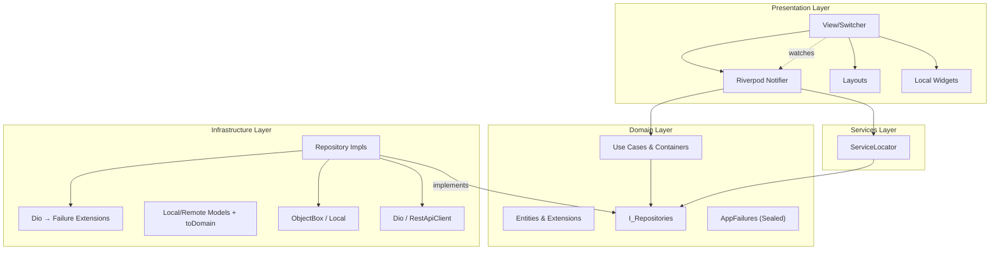

# DAB App — Flutter Client Architecture

> **Package:** `dab_app/` · Framework: Flutter · SDK: `^3.9.2`

---

## Architecture Schema



---

## Layer Details

### 1. Domain Layer (`lib/domain/`)

Pure Dart. Zero Flutter or third-party framework imports.

- **Entities:** Business objects — no "Entity" suffix. API-aligned types plus:
  - `Activity`, `ActivityProvider`, `ActivityCategory`, `ActivitySearchQuery`, `ActivityLiveEvent`
  - `ActivityFollow`, `FollowCandidate`, `DailyReport`, `DailyReportLine`, `GitWatchList`, `GitBranchList`, `JiraProject` / `JiraProjectWatchList`, `LinearTeam` / `LinearTeamWatchList`
  - `User` (`linkedProviderIds` Directory hint), `UserIdentity`, `Group`
  - `ProviderConfig`, `ProviderConnectivityReport`, `SystemStatus`
  - `Presence`, `AuthResponse`, `AppSettings`, `SprintContext`, `ExplorerCacheClearRequest`

- **Entities use `dart_mappable`** for serialization, equality, and `copyWith`.

- **Extension-First:** Helpers on an entity are `extension OnUser on User` in the **same file**. Presentation copy/layout helpers live in `lib/presentation/core/extensions/` — **one file per receiver** (`OnActivity.dashboardHeadline`, `OnActivityFollow.watchingPlaceholderActivity`).

- **Use Cases:** Atomic business actions (e.g., `Login`, `FetchActivities`).

- **Use Case Containers:** Aggregators (e.g., `AuthUseCases`) that group related use cases and inject the required `IRepository` instances.

- **Repository Interfaces:** `abstract interface class I[Name]Repository extends IRepository`. Returns `Either<AppFailure, T>`.

- **Failures:** Sealed `AppFailure` — `ServerFailure`, `NetworkFailure`, `AuthFailure`, `ValidationFailure`, `UnknownFailure`.

---

### 2. Infrastructure Layer (`lib/infrastructure/`)

Implements Domain contracts. Handles protocols, APIs, and databases.

- **Repositories:** Concrete `[Name]Repository extends Repository implements I[Name]Repository`. Orchestrate datasources.

- **Datasources:**
  - **Remote:** `RestApiClient` wrapping Dio. Includes `VegasInterceptor` for sync token management and `AuthInterceptor` for JWT injection + refresh.
  - **Local:** `ObjectBoxStore` — ultra-fast O(1) device persistence.

- **Models:** DB/API-specific DTOs. **Every model must** have an `extension On[Model] on [Model]` with a `toDomain` getter, co-located in the same file.

- **Error Mapping:** Converts `DioException` → `AppFailure`. Located in `lib/infrastructure/core/extensions/dio_extensions.dart`.

---

### 3. Presentation Layer (`lib/presentation/`)

Handles UI and state via **`flutter_riverpod`** (`Notifier` / `NotifierProvider`, `ConsumerWidget`).

#### The View Hierarchy (mandatory structure)

Every screen module in `lib/presentation/views/[view_name]/` must follow:

```
[view_name]/
├── [name]_view.dart           ← LayoutBuilder + post-frame notifier bootstrap
├── layouts/                   ← device-specific layouts (mobile, desktop)
│   ├── [name]_view_mobile.dart
│   └── [name]_view_desktop.dart
├── [name]_notifier.dart       ← Riverpod notifier + provider declaration
├── [name]_state.dart          ← immutable, isolated state file using ViewStatus
├── models/                    ← feature-local enums and data classes
└── widgets/                   ← one widget per file; subfolder for parent + children
```

#### Application Views

Home branches (**Dashboard**, **Explorer**, **Insights**, **Reports**, **Admin**) use a compact **view toolbar** (`ViewToolbar` in `lib/presentation/core/widgets/view_toolbar.dart`) — one left-packed row (horizontal scroll if needed), no glass capsule. Explorer pins refresh on the trailing edge. Controls share the same density (`DabToggleChip`, compact `DabIslandStat`):

- **Dashboard:** Timeline / Category / Provider chips, Directed/Following/Archived counts, last-sync, and the show-archived chip.
- **Explorer:** date strip fills the toolbar width (as many days as fit), with Today/Day/Range chips and refresh on the same row. Activity count, kind chips, and heat sit on a second row.
- **Reports:** Directory of teammates (managers/admins) plus a dated list of that person's reports (today is always listed for your own). **Unlocked** / **Locked** plus a live countdown to the Admin deadline (own report), **Save** (enabled after edits; hidden after the deadline), Copy / Download Markdown. Search above the list adds extra activities onto the open day.
- **Insights:** tappable date range (`showDateRangePicker`) and Today / 7d / 30d / Custom presets. KPIs stay in the body.
- **Admin (desktop):** inline providers `active/total`, users, failed connections, refresh `IconButton`. Unresolved identities appear only in org mode when the count is greater than zero. Section nav stays in the sidebar.
- **Admin (mobile/tablet):** section chips and refresh.

Shared glass panels use `DabGlassSurface` (`AppGlassTheme`). Chrome icons use `AppIcons`. Multi-select sidebar filters (Explorer, Insights, Admin, Settings cache) use shared `SelectionTile`. Directory chrome is shared (`DirectoryPanel` in `lib/presentation/core/widgets/`): Explorer and Insights include Users/Groups plus group CRUD; Reports is users-only and single-select. On desktop, Explorer and Insights share `FilterSidebar` — collapsible **Directory**, **Activities**, and **Providers** sections (Directory fills leftover height). Reports uses the same `FilterSidebar` with **Directory** (managers/admins) plus a **Reports** date list for the selected person. **Insights** adds filterable analytics cards/charts. **Admin** metrics are projected from `AdminState` via `OnAdminState.islandBarModel`.
User-visible strings use **`AppLocalizations`** (`context.l10n` via `lib/presentation/core/localization/l10n_extension.dart`); add keys to `lib/presentation/core/localization/l10n/app_en.arb` and run `flutter gen-l10n`. Secondary locale ARBs (`app_es.arb`, `app_de.arb`, `app_fr.arb`, `app_pt.arb`, `app_it.arb`) should carry the **same message key set** as English (same JSON keys as `app_en.arb` except **`@` metadata entries**—placeholder definitions and `description` live **only** in the template file). Where a translation is still pending, the value may match English until localized. Keys missing from a locale file fall back to the template locale at build time.
The home shell branding uses `brandShortName` / `brandTagline` (`DAB` / **Dev Activity Board**) as primary and secondary marks on supported widths; those strings are **the same in every locale** (product names, not translated).

| View | Role | State Pattern |
|---|---|---|
| **Splash** | App bootstrap + redirect | Always **DAB-branded** (`AppTheme.dab`): mesh background, brand icon + marks + spinner; **`package_info_plus`** shows **Version {semver}+{build}** at bottom after async load. Routing waits **≥ 1s** on-screen then `context.go` once auth resolved (`splashDestinationPath` in `splash_route_resolution.dart`). **GoRouter** loads splash at **`/`** with **`NoTransitionPage`** (no entry animation). **Auth** and the **home `StatefulShellRoute`** use a shared **fade** (`CustomTransitionPage` in `fade_transition_page.dart`) when replacing splash. Global **`redirect`** treats **`/`** and **`/auth`** as public so cold start is not forced straight to auth before splash runs; protected **`/home/*`** etc. still redirect guests to **`/auth`**. |
| **Auth** | Auth gate (`AuthView`) | Form via `AuthFormNotifier`; session in `authNotifierProvider`. The register toggle is shown **only while `isSystemConfigured` is false** (bootstrap): the first registered user becomes admin; afterwards self-registration is closed and accounts are created from the Admin Console. |
| **Home** | Shell around home tabs | `HomeView` + `StatefulNavigationShell` (`/home/dashboard`, `/home/explorer`, `/home/insight`, `/home/reports`, `/home/admin`). Not a data screen. |
| **Dashboard** | Personal inbound inbox | Initial hydration from `GET /activities/live` (user scope; never `scope=global`), then live updates via authenticated `/ws` (`ACTIVITY_RECEIVED` to the signed-in recipient only). While the desktop window is **unfocused**, `DashboardNotifier` may show an OS-local banner (`flutter_local_notifications`) with the card headline and Directed/Following subtitle — copy stays on device. Focused (`AppLifecycleState.resumed`) skips banners. Archive/unarchive does not notify. Always shows **two panes**: **Directed at you** (mentions, assignments, CCs, git watches) and **Following** (later updates on Follow-pinned objects). Wide layouts are a **2:1** side-by-side split (Directed larger); narrow layouts stack Directed over a shorter Following strip. Separation is whitespace (`AppSpacing.sectionGap`), not a divider. Each pane has its own scroll. Overlap (mentioned **and** Following) yields two independent inbox items. The Following pane has a focused autocomplete field (`GET /users/me/follows/candidates`) for Phorge/Jira/Linear issues (empty query is involved; a typed query substring-matches the display title — task number or keyword — in the team/project allow-list), Figma files (when typed), and, when typed, Admin-allow-listed git branches. Suggestions appear in a floating overlay only while the field is focused. Git Settings watches stay Directed; an explicit `owner/repo|branch` Follow is the only git path onto Following. Per-item Archive/Unarchive and Follow/Unfollow on followable cards (including git commits that carry a branch). Archive flags live on `activities:user:{id}`. The toolbar switches **Timeline / Category / Provider** layout (`DashboardFeedMode`, session-only), Directed/Following/Archived counts, last-sync, and the show-archived chip. Desktop has no sidebar. |
| **Reports** | Personal daily-report authoring | Org-calendar day (today by default) × (Directed-at-me **union** authored-by-me) when viewing **you**. `ReportsNotifier` hydrates `GET /activities/live` and subscribes to `/ws` itself (does not read `dashboardNotifierProvider`). Authored rows come from `GET /activities/search?authoredOnly=true` for the signed-in user. A search field (`GET /users/me/follows/candidates?q=` for Phorge/Jira/Linear **tasks** whose display title contains the query — task number or keyword — plus `GET /activities/search` last 30 org-calendar days, `authoredOnly=true`) lets the author pick extra items onto the open day even when they have no events that day. The desktop sidebar is always shown: **Directory** (managers/admins, users only, single-select) plus a **Reports** list of saved dates for the selected person (`GET /users/me/day-reports` or `GET /users/:id/day-reports`). Own list always includes **today** so a new day can be written. **Managers and admins** may **read** `GET /users/:id/day-reports/:date` (copy Markdown); they cannot PUT notes for someone else. Standard users cannot open another user’s report. Empty teammate list shows an empty state. Lines merge by **subject key** (provider + object + occurrence — commit sha / comment id / message ts, not git Follow `owner/repo\|branch`). Default all included; optional DAB-only note per included line. Persist via **Save** (`PUT /users/me/day-reports/:date`) — not debounced; the button is enabled after an edit and disabled after a successful save. Own reports become **read-only** after the Admin **report deadline** (`daily_report_lock_offset_days` + `daily_report_lock_time` in org timezone; default next-day 00:00 so a day can be edited only while that date is current). PUT after the cutoff is 403. Generate Markdown (time, provider, headline, note) for clipboard + `.md` download — no LLM. Follow-lane live rows are not auto-merged; search still adds any picked task or authored activity onto the open day. The toolbar shows **Unlocked** plus a countdown to the Admin deadline, then **Locked** after cutoff. Not a Dashboard clone (no archive/Follow required). |
| **Explorer** | Historical activity browser | Chronological strip with selectable timeframe; on load selects **all** directory users (`selectedUserIds`) then narrows to the signed-in user when matched (same breadth as Insights for the logged-in path). Sidebar **Providers** and **Activities** lists include admin-**activated** providers on first paint from cached app configs. Connection-test warning/failure (common when Live webhooks are unset) does **not** hide a provider. Green still comes from an Admin test **or** a healthy user credential (Settings → **Connect with Figma**). Figma comments map to **Message** (generic chat icon, not Slack); last-edited maps to **Generic**. Explorer groups comments by file: the card title is **`[folder_name] file name`** when Figma meta includes a folder (for example `[dajo. Plugin] DAB`), otherwise the file name; history rows are the **comment text and author**. Sender is the Figma handle or linked DAB name, never a Figma user id. Explorer polling needs **file keys or file URLs** (Admin Polling) and/or Figma **Follow** pins — Connect OAuth cannot list a team, so an empty catalog returns no Figma rows even after Connect succeeds. The Follow picker accepts a pasted `figma.com/design/…` URL. Figma live webhooks still require a Professional+ Figma team. Directory notes teammates who have not connected a selected provider. **Clear cache and refresh** (toolbar) evicts ObjectBox rows for the active day or range across all browsable providers, then refetches from provider APIs. Each selected provider is searched in parallel (`GET /activities/search?providers=` one id); rows paint as that call returns. A **linear** progress bar stays at the top of the list until every selected provider finishes — the circle spinner is not used on this feed. |
| **Insights** | Filterable behavior analytics | KPI + trend + provider/type/user breakdowns with details table; search uses **`authoredOnly=false`** for team-aggregate provider queries (Explorer keeps **`true`**). The desktop sidebar is the same `FilterSidebar` as Explorer (Directory / Activities / Providers, including group CRUD and “not connected” user subtitles). Provider and activity-type filters match Explorer: activated providers with a **green** org test or user credential appear and stay synced with `appNotifierProvider`. The toolbar is the date range plus Today / 7d / 30d / Custom presets. |
| **Settings** | User personalization | Theme, **inbox banners** (local Directed/Following OS notifications while the window is unfocused; default on), language, Explorer cache, and **Connected accounts**. Route stays `/settings` (not a home tab) with `DabMeshBackground` and home-like back chrome to Dashboard. GitHub, GitLab, Linear, Jira, Bitbucket, and Figma use **Connect with {provider}** (browser OAuth). After connect, **link the identity** so mentions and watches can target you. After Jira is connected, Settings shows a **project picker** that writes instance `projectKeys` (Explorer ingest allow-list; Connect also seeds keys from whoami). After Linear is connected, Settings shows a **team picker** that writes instance `teamKeys`. After GitHub/GitLab/Bitbucket is connected, Settings shows a **personal repo picker** and a **searchable branch dropdown** (add chips; none selected means all branches) stored on the user credential — that list targets the Dashboard git inbox and Explorer git polling. Figma Follow is the **file** (`file_key`); pin from a live card or paste a `figma.com/design/…` URL in the Following picker. There is no Settings Figma watch list. Phorge still uses a Conduit token after Admin saves the instance URL. Slack/Discord bots are configured in Admin. Tokens are never stored on the device. |
| **Admin Console** | System administration | In **managed** mode: Provider Config cards (Core / Live / Polling), Identities, Security. In **individual** mode: **Security** (users, timezone, report deadline, `public_api_url` for OAuth callbacks and webhook defaults, deployment mode; domain lockdown hidden) and a **slim Providers** view (OAuth `clientId`/`clientSecret`, GitLab/Jira/Phorge `instanceUrl`, Slack/Discord bot + channels, plus **Live** webhook URL + secret — no org PATs except Figma’s poll **file keys or URLs** / optional **team ids** (Connect OAuth cannot list a team); Phorge also exposes Herald HMAC). Header status lights are green when those OAuth/bot/Phorge-URL fields are saved (not org PAT or live-ingest tests). Live webhook fields always follow Security `public_api_url` (a leftover `localhost` value is treated as stale, not an override). Instant Dashboard uses the provider webhook. `ActivityLivePollScheduler` does not refill the live inbox with authored poll rows. For Jira, paste the OAuth 2.0 (3LO) **Client ID** from the developer console (not App ID), add Jira API permissions, and register `{public_api_url}/integrations/jira/oauth/callback` exactly. Identities are hidden — OAuth whoami links them. Default section is Security. The Admin tab and `/home/admin` are **admins only** in both individual and managed mode. |

#### Dashboard (Live Feed + Archive)

- **Desktop layout** is a column: dashboard toolbar and `DashboardLiveFeedScope` (two side-by-side `DashboardLiveFeed` panes at **2:1**, Directed wider; see `DashboardViewDesktop`). Body side gutters are `AppSpacing.xxxl` (64) each; the toolbar itself stays on the standard inset.
- **Mobile layout** stacks the same panes at **2:1** height (`DashboardViewMobile`); Directed on top, Following a shorter strip below. Both stay on screen with independent scroll. There is no Directed/Following tab switch. The panes are separated by `AppSpacing.sectionGap` whitespace, not a divider.
- Directed/following/archived counts sit in the toolbar. Provider health still drives **Provider** feed-mode columns (`providerHealth` on `DashboardState`): one row per **Admin-activated** provider, colored from `appNotifierProvider.providerConnectionStatuses` (green until a connection test **and** credential both fail). Connected Settings credentials are applied **before** org Admin tests so status does not flash red while Live webhook probes run. Quiet providers with no live events stay green. `lastEventAt` is optional metadata and does not drive color.
- Each pane splits `visibleActivities` on `Activity.inboxLane` (`directedVisible` / `followedVisible`; missing/legacy JSON is directed). Timeline / Category / Provider layout applies independently per pane. Timeline mode draws a vertical **HH:mm rail** to the left of each `DashboardActivityCard` (org timezone via `orgLocalFromUtc`), with a date crumb when the org-calendar day changes. **Following** uses the same rail without the 72px time column (`compact: true`); clock time lives on the card so the 1/3-width pane can show the subject. **Category** mode groups that pane's subset into one glass container per `ActivityCategory` (Commit, Revision, Task, Message, Generic), including quiet types with an empty hint. **Provider** mode uses one container per Admin-activated provider from `providerHealth` (quiet providers keep an empty column) plus any extra names that appear only on the feed. Category and Provider use a **responsive masonry** grid (`MasonryGridView`): column count is `min(itemCount, 3, width ~/ 320)` so leftover viewport width **widens** tiles instead of adding skinny kanban columns, and each container sizes to its content.
- Each `DashboardActivityCard` exposes an Archive action (trashcan) or Unarchive (refresh) routed through **`dashboardNotifierProvider`** with **optimistic UI** and rollback on failure. Followable cards also expose Follow / Following (bookmark) next to Archive. Follow pins hydrate with the live feed from `GET /users/me/follows`. The Following pane search (`DashboardFollowSearch`) is a normal text field: suggestions from `GET /users/me/follows/candidates` appear in a floating overlay only while the field is focused. The field and overlay share a tap-region group so choosing a row Follows it before the overlay dismisses. Following immediately shows a placeholder **card in the Following feed** via **`OnActivityFollow.watchingPlaceholderActivity`**; that card hides once a Follow-lane live event exists for the same object, and unfollow stays on the live card bookmark. `PUT /users/me/follows` stores the title/url snapshot. Dashboard does not reuse Explorer’s grouped `ActivityCard`. The same cards are used in every feed mode.
- **Live feed card copy:** Headline is **`OnActivity.dashboardHeadline`**. **From** uses l10n `dashboardActivityFromAuthor` with **`OnActivity.senderDisplayName`** (never a raw provider user id). Archived badge is l10n `dashboardCardArchivedBadge`. Following cards are compact (smaller padding, unpadded glyph, no chevron). Lane subtitle uses **`OnActivity.dashboardInboxLaneSubtitle`**.
- Remote `ACTIVITY_ARCHIVED` / `ACTIVITY_UNARCHIVED` events on the WS stream are surfaced as `ActivityLiveEvent` subtypes (`ActivityReceivedEvent`, `ActivityArchivedEvent`, `ActivityUnarchivedEvent`) and merged into the same list by flipping the entry's `archived` flag in place.
- After a new live row is prepended, if Settings inbox banners are on and the window is not focused, `NotifyInboxActivity` shows a local OS banner (headline via `OnActivity.dashboardHeadline`; subtitle Directed vs Following). Remote FCM wakes (later mobile) are data-only and never carry activity copy.
- The toolbar hosts exclusive Timeline / Category / Provider `DabToggleChip`s, Directed/Following/Archived counts, last-sync, and the show-archived chip. A reconnect notice can appear above both panes after a WS gap.

#### Explorer Historical Cache Strategy

- Explorer searches now use a shared `ActivitySearchQuery` contract across remote and local sources.
- Explorer issues **one search per selected provider** and merges/regroups the list as each call returns. A new date or filter generation clears the list so windows do not mix. Coverage remains per `(day, user, provider)`.
- For date windows fully in the past, the repository reads ObjectBox first (`ExplorerActivityRecord`) and only falls back to API when that provider's coverage is incomplete.
- On backfill, the repository upserts the mapped API response for the requested provider(s) into ObjectBox.
- Coverage is tracked per `(day, user, provider)` via `ExplorerCoverageRecord` so newly activated providers trigger targeted backfill for already-cached days. Day keys follow the organization timezone from bootstrap (`GET /metadata/status` → `AppState.orgTimezoneId`).
- **Settings → Explorer cache** lets users clear cached activities and coverage for a chosen org-calendar date range and provider subset; the next Explorer browse for those days refetches from provider APIs. Admin timezone saves still perform a full cache clear.
- Explorer and Insights date filtering, API query parameters, and ObjectBox cache keys all use the same org-calendar semantics.
- For windows including today, Explorer remains remote-first to keep mutable day data fresh.

---

### 4. Services Layer (`lib/services/`)

- `ServiceLocator` — custom singleton in `lib/services/service_locator.dart` (not GetIt). This is the only place dependencies are wired. REST and WebSocket origins come from `ApiBaseUrl` (`--dart-define=DAB_API_BASE`, default local Docker). Hosted API: [deployment.md](./deployment.md).

---

## State Management Rules

- **Riverpod:** Feature modules expose **`Notifier` / `AutoDisposeNotifier`** classes registered as **`NotifierProvider`** / **`NotifierProvider.autoDispose`** next to the notifier implementation.
- **ViewStatus:** All states must use the unified `ViewStatus` enum (`initial`, `loading`, `success`, `failure`) for standardized status management.
- **One Widget Per File:** View, layout, and widget files must not contain extra widget classes. Extract each widget to `widgets/` (or a subfolder of `widgets/` when a parent needs several files). State classes stay with their `StatefulWidget`.
- **Global app session:** Cross-cutting concerns use **`appNotifierProvider`**, **`authNotifierProvider`**, and router refresh hooks — no static cubit singletons.
- **Widgets:** Prefer **`ConsumerWidget`** / **`ConsumerStatefulWidget`** with **`ref.watch`** / **`ref.read`** on the smallest subtree that needs updates.
- **Notifiers call use cases only** — never datasources or repositories directly.
- **No business logic in widgets.** Widgets read state and call notifier methods — nothing more.

---

## Navigation (go_router)

All routes are declared in `presentation/core/navigation/app_route.dart` and wired in `presentation/core/navigation/app_router.dart`.

- Use named routes — never push raw path strings.
- Auth guards (`redirect` logic) live in the router configuration, not in widgets.
- Never import a screen file directly into another screen for navigation.

---

## Vegas Sync — Client-Side Implementation

1. **Storage:** `AppSettingsRecord` in ObjectBox stores the global `syncToken`.
2. **VegasInterceptor:**
   - **Outgoing:** Injects `X-Sync-Token` header.
   - **Incoming:** Extracts `meta.syncToken` from envelope responses and updates ObjectBox.
   - **Short Circuiting:** On `304 Not Modified`, repositories return cached ObjectBox data immediately.
3. **Real-Time Layer:** WebSocket connection pushes new events while the app is alive.

---

## Dynamic Deep-Linking & Provider Config Resolution

1. **Bootstrap:** On init, **`AppNotifier`** (via `appNotifierProvider`) fetches `List<ProviderConfig>` from `/metadata/configs`.
2. **Resolution:** `ActivityCard` matches `Activity.provider.name` against the loaded configs.
3. **URL Joining:** If the backend provides a relative path (e.g., `/T123`), the card prepends `ProviderConfig.baseUrl`.
4. **Icons:** Provider icon resolution is centralized in `ProviderIconResolver`:
   `ProviderConfig.iconUrl` → `ProviderStyles` brand map → `simple_icons` fallback → `AppIcons.unknownProvider`.

---

## Auth & Token Security

- JWTs stored exclusively in `FlutterSecureStorage` (native OS Keychain / Keystore).
- Token refresh handled entirely by `AuthInterceptor` — presentation code must not trigger refresh manually.
- A 401 on a protected route with no refresh token, or a failed refresh, clears the local session and `authNotifierProvider` so the router returns to Login. That avoids a zombie session where Settings still looks signed-in but `oauth/start` has no Bearer token.
- On logout: clear session via **`authNotifierProvider`** / routing **and** secure storage atomically.
- **Identity linking:** Mentions and watches target the signed-in user through `user_identities` (Connect whoami or Admin link). The client `User.linkedProviderIds` list is a Directory hint only.

---

## Design System: Premium Glassmorphism

The project uses a unified design system centered around Material 3 roles, implemented in `lib/presentation/core/styles/`.

| Token Category | File | Description |
|---|---|---|
| **Colors** | `lib/presentation/core/styles/app_colors.dart` | M3 roles + Electric Indigo (`#6366F1`) & glass tokens |
| **Spacing** | `lib/presentation/core/styles/app_spacing.dart` | Base 4px grid (tiny=4, small=8, medium=16, large=24) |
| **Typography** | `lib/presentation/core/styles/app_text_styles.dart` | **Mona Sans** for UI, **JetBrains Mono** for monospaced text |
| **Layout** | `lib/presentation/core/styles/app_layout.dart` | Viewport constraints, standard border radii (12-24px) |
| **Icons** | `lib/presentation/core/styles/app_icons.dart` | Centralized icon map (`flutty_heroicons` for non-provider UI, `simple_icons` for provider brands) |
| **Themes** | `lib/presentation/core/styles/app_theme.dart` | `AppTheme.light` (warm neutral canvas, white elevated cards with soft shadow, stone foreground roles, soft input borders, frosted glass with neutral grey border; icons stay primary/indigo; shared `SelectionTile` / `DirectoryTile` use neutral surface fills and grey borders—no primary glow), `AppTheme.dab`, `AppTheme.greyscale`. `checkboxTheme` / `chipTheme` / `switchTheme` match toolbar chips. |
| **Control kit** | `lib/presentation/core/widgets/` | Shared chrome: `DabGlassSurface`, `DabToggleChip`, `DabIslandStat`, `ActivityProviderIcon`, `SelectionTile`, `ViewToolbar`, `DirectoryPanel`, `FilterSidebar`. |

### Premium Glassmorphism
- **Surface**: `AppColors.glassSurface` (low opacity slate) + backdrop blur `σ 8–12`.
- **Borders**: Subtile `1px` lines using `AppColors.glassBorder` (white alpha).
- **Branding**: Elevated by **Electric Indigo** accents for high-contrast interactivity.

### Micro-Animations
- **Staggered Entrances:** Dashboard cards animate in with a 50ms stagger.
- **Provider Glow:** Hover reveals `BoxShadow` colored by provider glow roles (e.g., Slack Purple `#4A154B`).
- **Pulsing Connection Icons:** Admin provider cards show real-time connection status (`ViewStatus`: Success/Failure/Loading) with smooth opacity pulsing.
- **Entry Pulse:** Incoming WebSocket events trigger a spring-scale transition.

---

## Development Commands

| Action | Command |
|---|---|
| Analyze | `flutter analyze` |
| Run tests | `flutter test` |
| Run app | `flutter run` |
| Regenerate code | `dart run build_runner build --delete-conflicting-outputs` |
| Generate launcher icons | `flutter pub get` then `dart run flutter_launcher_icons` |
| Generate l10n | Automatic via `l10n.yaml` (`flutter gen-l10n`) |

**Launcher icons** follow [flutter_launcher_icons](https://pub.dev/packages/flutter_launcher_icons): configuration lives in `dab_app/flutter_launcher_icons.yaml` (the CLI default; see package guide). Source image: `dab_app/assets/branding/app_icon.png`. To scaffold a new config file, run `dart run flutter_launcher_icons:generate` (use `-o` to overwrite). Platform folders (`ios/`, `android/`, `macos/`, etc.) must exist before the tool can write icons—run `flutter create . --platforms=...` in `dab_app/` when setting up a fresh clone where those directories are absent.
