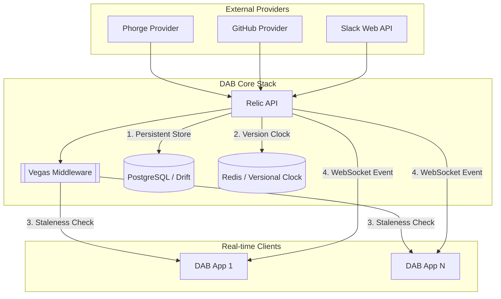

# DAB Infrastructure — Technical Blueprint

> **Linear source:** [Dab Infrastructure](https://linear.app/dev-activity-board/document/dab-infrastructure-339365576c10) · Last synced: 2026-04-08  
> **Stack:** Dart + Relic · PostgreSQL + Drift · Redis · WebSocket · Docker Compose

---

## System Topology & Event Fan-Out

DAB is built on a high-availability "Push" architecture using the **Vegas Internal Sync Pattern** to handle large data bursts with minimal bandwidth.



### Scalability & Performance Targets

| Metric | Target |
|---|---|
| Developer density | 100+ concurrent developers per instance |
| Feed latency | < 50ms end-to-end (ingestion → dashboard) |
| Sync overhead | Near-zero on unchanged data (Vegas 304 short-circuit) |

---

## Database Architecture (PostgreSQL + Drift)

DAB implements **Table-per-Type (TBT)** polymorphic schema to ensure strict metadata integrity without JSON blob anti-patterns.

### Schema Overview

```
activities                  ← Base table: id, userId, title, content, provider, createdAt, updatedAt
  └── activity_phorge       ← Phorge metadata: phid, tags, revisionId, transactionType
  └── activity_github_commit← GitHub commit metadata: repo, branch
  └── activity_slack_message← Slack metadata: workspaceId, channelId, threadTs, messageTs
```

- **Relational integrity:** Child tables reference `activities.id` with `CASCADE DELETE`.
- **Hydration:** `leftOuterJoin` in repository implementations — never duplicate base fields.
- **Migrations:** Fully automated via Drift's `MigrationStrategy`. Never hand-edit `*.g.dart` files.

### Key Tables

| Table | Purpose |
|---|---|
| `activities` | Normalized activity base |
| `activity_phorge` | Phorge-specific metadata |
| `activity_github_commit` | GitHub commit-specific metadata |
| `activity_slack_message` | Slack message-specific metadata |
| `users` | DAB user accounts |
| `user_identities` | External provider account linkage |
| `sessions` | Active auth sessions |
| `groups` | Organizational groups |
| `provider_configs` | External provider configuration |

Identity linkage (`user_identities`) is the runtime source of provider
participation for activity fetchers. Legacy tenants with historical
`users.phorge_phid` data should run a one-time backfill into
`user_identities(provider_id='phorge')` before enabling identity-only fetch.

Slack ingestion is read-only and identity-gated: only messages authored by
linked Slack identities (`provider_id='slack'`) are attributed. Provider
credentials are stored in `provider_configs.settings` (`botToken`, optional
`channels`, optional `apiBaseUrl`).

---

## Caching & Synchronization (Redis)

Redis serves as the high-speed **versional clock** and fan-out engine.

### 1. The Vegas Pattern

| Step | Mechanism |
|---|---|
| **Global clock** | `INCR dab:version` — atomic increment on every write |
| **Sync tokens** | Every API response embeds the current `syncToken` in `meta` |
| **Client request** | Client sends `X-Sync-Token` header with its last known token |
| **Vegas Middleware** | Compares token; returns `304 Not Modified` if client is current |

### 2. Materialized Feed Keys

| Redis Key | Type | Use Case |
|---|---|---|
| `activities:global` | LIST | Rolling dashboard feed (last 500 items) |
| `activities:user:{id}` | LIST | Personal activity feed |
| `activities:date:{iso}` | ZSET | Temporal sharding for date-range queries |
| `insights:stats:{iso}` | HASH | Real-time counts per provider category |
| `insights:rankings:{iso}:total` | ZSET | Global team leaderboard by contribution |

---

## WebSocket Real-Time Layer

- **Endpoint:** `ws://host:8081/ws`
- **Protocol:** Clients upgrade HTTP → WebSocket on connect.
- **Payloads:** `ACTIVITY_RECEIVED` events pushed on every new ingestion.
- **Graceful Degradation:** If WebSocket is unavailable, clients fall back to polling with Vegas sync tokens.

---

## Docker Deployment

```bash
# Start all services (API + PostgreSQL + Redis)
docker-compose up -d

# Production deployment
docker-compose -f docker-compose.prod.yml up -d
```

### Service Map

| Service | Port | Role |
|---|---|---|
| `dab_api` | `8080` | REST API |
| `dab_api` | `8081` | WebSocket |
| `postgres` | `5432` | Primary database |
| `redis` | `6379` | Cache + versional clock |

---

## Configuration Guardrails

| Guardrail | Mechanism |
|---|---|
| **Auth enforcement** | JWT Middleware on all protected routes |
| **Domain lockdown** | Rejects registrations outside `DAB_ALLOWED_DOMAIN` |
| **Bootstrap lock** | Platform locked until first admin completes setup (`AdminController`) |
| **Envelope pattern** | All responses wrapped in `{ data, meta }` — never raw JSON |

### Required Environment Variables (`.env`)

```
DAB_DB_HOST=
DAB_DB_PORT=5432
DAB_DB_NAME=dab
DAB_DB_USER=
DAB_DB_PASSWORD=
DAB_REDIS_URL=
DAB_JWT_SECRET=
DAB_JWT_EXPIRY=
DAB_ALLOWED_DOMAIN=
DAB_API_PORT=8080
DAB_WS_PORT=8081
```

> See `.env.example` for the full reference.

---

## Health Check Endpoints

| Check | Endpoint | Expected Response |
|---|---|---|
| API Pulse | `GET /health` | `{"status": "ok", "version": "1.0.0"}` |
| DB Health | `GET /health/db` | `{"connected": true, "latency_ms": <10}` |
| WSS Stream | `ws://host:8081/ws` | Successful upgrade + `ACTIVITY_RECEIVED` payloads |

---

## Test Infrastructure

- **`TestRequest`:** Bypass utility for creating Relic `Request` objects (normally private) for isolated controller testing.
- **`TestData` (Object Mother):** Centralized factory library generating high-fidelity mock entities (Phorge tasks, GitHub commits, admin users) for consistent test scenarios.
- **Integration tests:** Tagged `@Tags(['integration'])`. Require live PostgreSQL + Redis. Excluded from unit CI runs.
