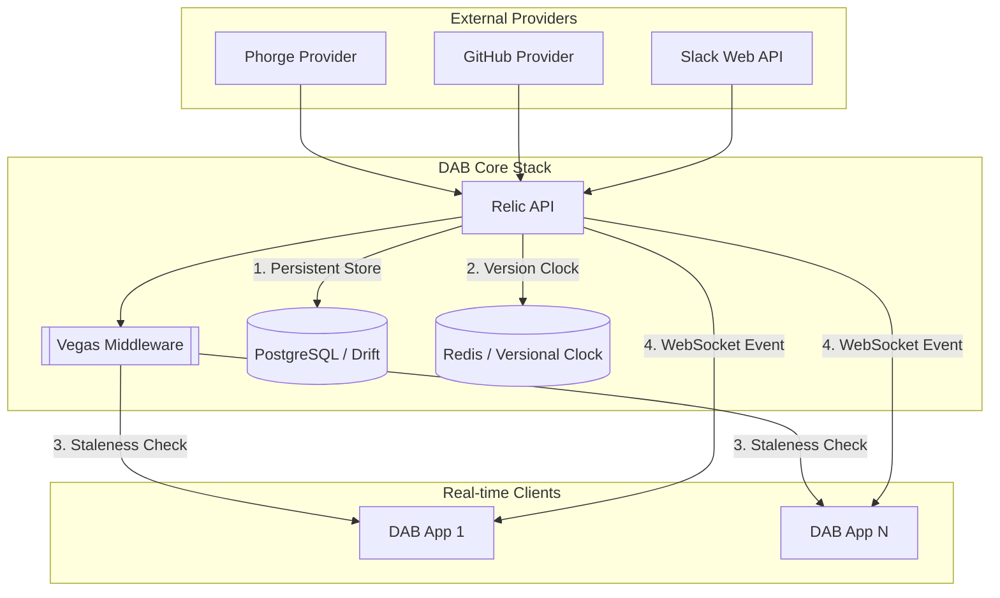

# DAB Infrastructure — Technical Blueprint

> **Linear source:** [Dab Infrastructure](https://linear.app/dev-activity-board/document/dab-infrastructure-339365576c10) · Last synced: 2026-04-08  
> **Stack:** Dart + Relic · PostgreSQL + Drift · Redis (Vegas) · WebSocket · Docker Compose

---

## System Topology & Event Fan-Out

DAB is built on a high-availability "Push" architecture using the **Vegas Internal Sync Pattern** to handle large data bursts with minimal bandwidth.



### Scalability & Performance Targets

| Metric | Target |
|---|---|
| Developer density | 100+ concurrent developers per instance |
| Feed latency | < 50ms end-to-end (ingestion → dashboard) |
| Sync overhead | Near-zero on unchanged data (Vegas 304 short-circuit) |

---

## Database Architecture (PostgreSQL + Drift)

DAB implements **Table-per-Type (TBT)** polymorphic schema to ensure strict metadata integrity without JSON blob anti-patterns.

### Schema Overview

```
activities                  ← Base table: id, userId, providerName, title, content, author, createdAt
  └── activity_phorge       ← Phorge metadata: taskPhid, revisionId, tags
  └── activity_github_commit← GitHub commit metadata: repo, branch
  └── activity_slack_message← Slack metadata: workspaceId, channelId, threadTs, messageTs
```

- **Relational integrity:** Child tables reference `activities.id` with `CASCADE DELETE`.
- **Hydration:** `leftOuterJoin` in repository implementations — never duplicate base fields.
- **Migrations:** Fully automated via Drift's `MigrationStrategy`. Never hand-edit `*.g.dart` files.

### Key Tables

| Table | Purpose |
|---|---|
| `activities` | Normalized activity base |
| `activity_phorge` | Phorge-specific metadata |
| `activity_github_commit` | GitHub commit-specific metadata |
| `activity_slack_message` | Slack message-specific metadata |
| `users` | DAB user accounts |
| `user_identities` | External provider account linkage |
| `sessions` | Active auth sessions |
| `groups` | Organizational groups |
| `provider_configs` | External provider configuration |

Identity linkage (`user_identities`) is the runtime source of provider
participation for activity fetchers. Legacy tenants with historical
`users.phorge_phid` data should run a one-time backfill into
`user_identities(provider_id='phorge')` before enabling identity-only fetch.

Slack ingestion is read-only and identity-gated: only messages authored by
linked Slack identities (`provider_id='slack'`) are attributed. Provider
credentials are stored in `provider_configs.settings` (`botToken`, optional
`channels`, optional `apiBaseUrl`).

---

## Caching & Synchronization (Redis)

Redis serves as the high-speed **versional clock** and fan-out engine.

### 1. The Vegas Pattern

| Step | Mechanism |
|---|---|
| **Global clock** | `INCR dab:version` — atomic increment on every write |
| **Sync tokens** | Vegas-enabled data responses embed the current `syncToken` in `meta` |
| **Client request** | Client sends `X-Sync-Token` header with its last known token |
| **Vegas Middleware** | Compares token; returns `304 Not Modified` if client is current |

### 2. Materialized Feed Keys

| Redis Key | Type | Use Case |
|---|---|---|
| `activities:global` | LIST | Rolling dashboard feed (last 500 items) |
| `activities:user:{id}` | LIST | Personal activity feed (last 100 items) |
| `activities:date:{yyyy-mm-dd}` | ZSET | Temporal sharding for date-range queries |
| `insights:stats:{yyyy-mm-dd}` | HASH | Real-time counts per provider category |
| `insights:rankings:{yyyy-mm-dd}:{category}` | ZSET | Category leaderboard by contribution |
| `insights:rankings:{yyyy-mm-dd}:total` | ZSET | Global team leaderboard by contribution |
| `dab:stream:events` | STREAM | Raw provider event ingestion stream |

The **dashboard** `GET /activities/live` response is built exclusively from Redis live keys (`activities:global` and `activities:user:{id}`); it never queries Postgres. Explorer uses **`GET /activities/search`**, which aggregates **provider APIs via `UnifiedActivityFetcher`** (no Postgres in that handler).

Slack live events reach these keys through a signed Events API webhook endpoint
(`POST /integrations/slack/events`) that ingests push callbacks. GitHub push
callbacks use `POST /integrations/github/webhook` with TLS + HMAC body
verification.

Optional **webhook dedupe**: short-TTL Redis keys `slack:event:{eventId}` and
`github:delivery:{delivery}` prevent replayed provider deliveries from
double-writing during the TTL window.

**Live feed window.** A background job runs at **UTC midnight** and rewrites
materialized lists `activities:user:*` and `activities:global`, removing entries
that are **archived** or whose `createdAt` is **before** the current UTC day.
The `GET /activities/live` handler applies the same UTC-day filter so clients
never see prior days if a purge was missed.

---

## WebSocket Real-Time Layer

- **Endpoint:** `ws://host:9080/ws` (same API service port by default)
- **Auth:** JWT-authenticated upgrade; request identity is used for scoped delivery
- **Protocol:** Clients upgrade HTTP → WebSocket on connect.
- **Payloads:** `ACTIVITY_RECEIVED` events pushed on every new ingestion.
- **Graceful Degradation:** If WebSocket is unavailable, clients fall back to polling with Vegas sync tokens.

---

## Docker Deployment

```bash
# Start all services (API + PostgreSQL + Redis)
cd dab_api && docker-compose up -d

# Production deployment
cd dab_api && docker-compose -f docker-compose.prod.yml up -d
```

### Service Map

| Service | Host Port (default) | Container Port | Env Override | Role |
|---|---|---|---|---|
| `api` (`relic`) | `9080` | `8080` | `API_PUBLIC_PORT` / `PORT` | REST API + WebSocket (`/ws`) |
| `api` (Dart VM) | `9181` | `8181` | `DART_VM_PUBLIC_PORT` | Dart VM service / observatory |
| `swagger` | `9081` | `8080` | `SWAGGER_PUBLIC_PORT` | Swagger UI (serves `doc/openapi.yaml`) |
| `db` (`postgres`) | `5433` | `5432` | `DB_PUBLIC_PORT` | Primary database |
| `redis` | `6379` | `6379` | `REDIS_PUBLIC_PORT` | Cache + versional clock |

> Host-side defaults for the API, Swagger, and Dart VM service moved from the
> `808x` range to `90xx/91xx` so DAB can coexist with other local APIs that
> already bind `8080`. Only the host mapping changed; inside the container the
> API still listens on `8080`. Override any of them via `dab_api/.env`.

---

## Configuration Guardrails

| Guardrail | Mechanism |
|---|---|
| **Auth enforcement** | JWT Middleware on all protected routes |
| **Domain lockdown** | Rejects registrations outside `DAB_ALLOWED_DOMAIN` |
| **Bootstrap lock** | Platform locked until first admin completes setup (`AdminController`) |
| **Envelope pattern** | All responses wrapped in `{ data, meta }` — never raw JSON |

### Required Environment Variables (`.env`)

```
DB_HOST=
DB_PORT=5432
DB_NAME=
DB_USER=
DB_PASS=
REDIS_HOST=
REDIS_PORT=6379
JWT_SECRET=
JWT_EXPIRY_MINUTES=60
DAB_ALLOWED_DOMAIN=
PORT=8080
DAB_INITIAL_ADMIN_EMAIL=
```
Production compose currently configures DB + API; if Redis is not in compose, provide an external Redis and set `REDIS_HOST` / `REDIS_PORT`.

---

## Health Check Endpoints

| Check | Endpoint | Expected Response |
|---|---|---|
| API Pulse | `GET /health` | `{"status":"healthy","timestamp":"..."}` |
| DB Health | `GET /health/db` | `{"status":"healthy|degraded","database":"connected|disconnected","timestamp":"..."}` |
| WS Stream | `ws://host:9080/ws` | Successful upgrade + `ACTIVITY_RECEIVED` payloads |

---

## Test Infrastructure

- **`TestRequest`:** Bypass utility for creating Relic `Request` objects (normally private) for isolated controller testing.
- **`TestData` (Object Mother):** Centralized factory library generating high-fidelity mock entities (Phorge tasks, GitHub commits, admin users) for consistent test scenarios.
- **Integration tests:** Tagged `@Tags(['integration'])`. Require live PostgreSQL + Redis. Excluded from unit CI runs.
